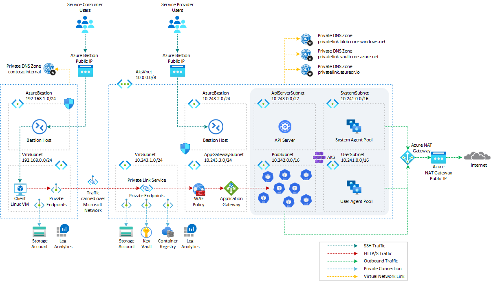
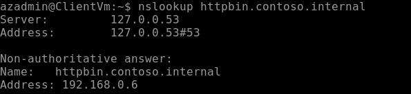
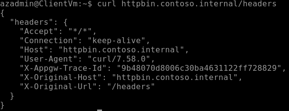

# How to call an AKS-hosted workload via Application Gateway Private Link and Application Gateway Ingress Controller

[Azure Application Gateway](https://learn.microsoft.com/en-us/azure/application-gateway/overview) can connect to a backend application via [Azure Private Link Service (PLS)](https://learn.microsoft.com/en-us/azure/private-link/private-link-service-overview). For more information, see [Application Gateway Private Link](https://learn.microsoft.com/en-us/azure/application-gateway/private-link).

Private Link for Application Gateway allows you to connect workloads over a private connection spanning across different virtual networks and Azure subscriptions. When configured, a private endpoint will be placed into a defined virtual network's subnet, providing a private IP address for client applications looking to communicate to a service behind an Application Gateway. For a list of other PaaS services that support Private Link functionality, see [What is Azure Private Link?](https://learn.microsoft.com/en-us/azure/private-link/private-link-overview).

This article shows how to use [Azure Application Gateway](https://learn.microsoft.com/en-us/azure/application-gateway/overview), [Azure Web Application Firewall](https://learn.microsoft.com/en-us/azure/web-application-firewall/afds/afds-overview), and [Azure Private Link Service (PLS)](https://learn.microsoft.com/en-us/azure/private-link/private-link-service-overview) to securely expose and protect a workload running in [Azure Kubernetes Service(AKS)](https://docs.microsoft.com/en-us/azure/aks/intro-kubernetes) via the [Application Gateway Ingress Controller](https://learn.microsoft.com/en-us/azure/application-gateway/ingress-controller-overview).

## Prerequisites

- An active [Azure subscription](https://docs.microsoft.com/en-us/azure/guides/developer/azure-developer-guide#understanding-accounts-subscriptions-and-billing). If you don't have one, create a [free Azure account](https://azure.microsoft.com/free/) before you begin.
- [Visual Studio Code](https://code.visualstudio.com/) installed on one of the [supported platforms](https://code.visualstudio.com/docs/supporting/requirements#_platforms) along with the [Bicep extension](https://marketplace.visualstudio.com/items?itemName=ms-azuretools.vscode-bicep).

## Architecture

This sample provides a set of Bicep modules to deploy and configure an [Azure Application Gateway](https://learn.microsoft.com/en-us/azure/application-gateway/overview) with an [WAF Policy](https://learn.microsoft.com/en-us/azure/web-application-firewall/afds/afds-overview) as regional layer 7 load balancer in front of a public or a private AKS cluster with [API Server VNET Integration](https://learn.microsoft.com/en-us/azure/aks/api-server-vnet-integration), [Azure CNI](https://learn.microsoft.com/en-us/azure/aks/configure-azure-cni) as a network plugin and [Dynamic IP Allocation](https://learn.microsoft.com/en-us/azure/aks/configure-azure-cni#dynamic-allocation-of-ips-and-enhanced-subnet-support). The sample implements a scenario where a client application consumes a service exposed by a SaaS provider. The server application workload runs on an [Azure Kubernetes Service(AKS)](https://docs.microsoft.com/en-us/azure/aks/intro-kubernetes) cluster and is exposed via the [Application Gateway Ingress Controller](https://learn.microsoft.com/en-us/azure/application-gateway/ingress-controller-overview). The frontend IP configuration of the [Azure Application Gateway](https://learn.microsoft.com/en-us/azure/application-gateway/overview) is configured to be exposed via [Private Link](https://learn.microsoft.com/en-us/azure/application-gateway/private-link). A frontend IP address is the IP address associated with an application gateway. You can configure an application gateway to have a public IP address, a private IP address, or both. An application gateway supports one public or one private IP address. Your virtual network and public IP address must be in the same location as your application gateway.

> **NOTE**  
> At the time of this writing, [Application Gateway Private Link](https://learn.microsoft.com/en-us/azure/application-gateway/private-link) configuration support for tunneling traffic through an Azure private endpoint to a private IP only Application Gateway is unsupported.

The following diagram shows the architecture and network topology deployed by the sample:



A [Deployment Script](https://learn.microsoft.com/en-us/azure/azure-resource-manager/bicep/deployment-script-bicep) is used to create a sample [httpbin](https://httpbin.org/) web application via YAML manifests. An [ingress](https://kubernetes.io/docs/concepts/services-networking/ingress/) is created to expose the Kubernetes service via the [Azure Application Gateway](https://learn.microsoft.com/en-us/azure/application-gateway/overview) via the [Application Gateway Ingress Controller](https://learn.microsoft.com/en-us/azure/application-gateway/ingress-controller-overview).

Bicep modules are parametric, so you can choose any network plugin:

- [Azure CNI with static IP allocation](https://learn.microsoft.com/en-us/azure/aks/configure-azure-cni)
- [Azure CNI with dynamic IP allocation](https://learn.microsoft.com/en-us/azure/aks/configure-azure-cni-dynamic-ip-allocation)
- [Azure CNI Powered by Cilium](https://learn.microsoft.com/en-us/azure/aks/azure-cni-powered-by-cilium)
- [Azure CNI Overlay](https://learn.microsoft.com/en-us/azure/aks/azure-cni-overlay)
- [BYO CNI](https://learn.microsoft.com/en-us/azure/aks/use-byo-cni?tabs=azure-cli)
- [Kubenet](https://learn.microsoft.com/en-us/azure/aks/configure-kubenet)

> **NOTE**  
> The sample was tested only with [Azure CNI with dynamic IP allocation](https://learn.microsoft.com/en-us/azure/aks/configure-azure-cni). [Azure CNI Overlay](https://learn.microsoft.com/en-us/azure/aks/azure-cni-overlay) does not currently support the [Application Gateway Ingress Controller](https://learn.microsoft.com/en-us/azure/application-gateway/ingress-controller-overview). For more information, see [Limitations with Azure CNI Overlay](https://learn.microsoft.com/en-us/azure/aks/azure-cni-overlay#limitations-with-azure-cni-overlay).

The Bicep modules also allow installing the following extensions and add-ons for [Azure Kubernetes Service(AKS)](https://docs.microsoft.com/en-us/azure/aks/intro-kubernetes):

In addition, this sample shows how to deploy an [Azure Kubernetes Service](https://docs.microsoft.com/en-us/azure/aks/intro-kubernetes) cluster with the following features:

- [API Server VNET Integration](https://learn.microsoft.com/en-us/azure/aks/api-server-vnet-integration) allows you to enable network communication between the API server and the cluster nodes without requiring a private link or tunnel. AKS clusters with API Server VNET integration provide a series of advantages, for example, they can have public network access or private cluster mode enabled or disabled without redeploying the cluster. For more information, see [Create an Azure Kubernetes Service cluster with API Server VNet Integration](https://learn.microsoft.com/en-us/azure/aks/api-server-vnet-integration).
- [Azure NAT Gateway](https://learn.microsoft.com/en-us/azure/virtual-network/nat-gateway/nat-overview) to manage outbound connections initiated by AKS-hosted workloads.
- [Event-driven Autoscaling (KEDA) add-on](https://learn.microsoft.com/en-us/azure/aks/keda-about) is a single-purpose and lightweight component that strives to make application autoscaling simple and is a CNCF Incubation project.
- [Dapr extension for Azure Kubernetes Service (AKS)](https://learn.microsoft.com/en-us/azure/aks/dapr) allows you to install [Dapr](https://dapr.io/), a portable, event-driven runtime that simplifies building resilient, stateless, and stateful applications that run on the cloud and edge and embrace the diversity of languages and developer frameworks. With its sidecar architecture, Dapr helps you tackle the challenges that come with building microservices and keeps your code platform agnostic.
- [Flux V2 extension](https://learn.microsoft.com/en-us/azure/azure-arc/kubernetes/tutorial-use-gitops-flux2?tabs=azure-cli) allows to deploy workloads to an Azure Kubernetes Service (AKS) cluster via [GitOps](https://www.weave.works/technologies/gitops/). For more information, see [GitOps Flux v2 configurations with AKS and Azure Arc-enabled Kubernetes](https://learn.microsoft.com/en-us/azure/azure-arc/kubernetes/conceptual-gitops-flux2)
- [Vertical Pod Autoscaling](https://learn.microsoft.com/en-us/azure/aks/vertical-pod-autoscaler) allows you to automatically sets resource requests and limits on containers per workload based on past usage. VPA makes certain pods are scheduled onto nodes that have the required CPU and memory resources. For more information, see [Kubernetes Vertical Pod Autoscaling](https://itnext.io/k8s-vertical-pod-autoscaling-fd9e602cbf81).
- [Azure Key Vault Provider for Secrets Store CSI Driver](https://learn.microsoft.com/en-us/azure/aks/csi-secrets-store-identity-access) provides a variety of methods of identity-based access to your [Azure Key Vault](https://learn.microsoft.com/en-us/azure/key-vault/general/overview).
- [Open Service Mesh add-on](https://learn.microsoft.com/en-us/azure/aks/open-service-mesh-about) is a lightweight, extensible, cloud native service mesh that allows you to uniformly manage, secure, and get out-of-the-box observability features for highly dynamic microservice environments.

In a production environment, we strongly recommend deploying a [private AKS cluster](https://docs.microsoft.com/en-us/azure/aks/private-clusters) with [Uptime SLA](https://docs.microsoft.com/en-us/azure/aks/uptime-sla). For more information, see [private AKS cluster with a Public DNS address](https://docs.microsoft.com/en-us/azure/aks/private-clusters#create-a-private-aks-cluster-with-a-public-dns-address). Alternatively, you can deploy a public AKS cluster and secure access to the API server using [authorized IP address ranges](https://learn.microsoft.com/en-us/azure/aks/api-server-authorized-ip-ranges).

The Bicep modules deploy the following Azure resources for the service provider:

- [Microsoft.Network/applicationGateways](https://learn.microsoft.com/en-us/azure/templates/microsoft.network/applicationgateways?pivots=deployment-language-bicep): an [Azure Application Gateway](https://learn.microsoft.com/en-us/azure/application-gateway/overview) resource used to expose the AKS-hosted sample application via [Azure Private Link Service](https://learn.microsoft.com/en-us/azure/private-link/private-link-service-overview) and [Application Gateway Ingress Controller](https://learn.microsoft.com/en-us/azure/application-gateway/ingress-controller-overview).
- [Microsoft.Network/ApplicationGatewayWebApplicationFirewallPolicies](https://learn.microsoft.com/en-us/azure/templates/microsoft.network/applicationgatewaywebapplicationfirewallpolicies?pivots=deployment-language-bicep): [Azure Web Application Firewall (WAF)](https://learn.microsoft.com/en-us/azure/web-application-firewall/ag/ag-overview) on [Azure Application Gateway](https://learn.microsoft.com/en-us/azure/application-gateway/overview) provides centralized protection for your web applications. WAF defends your web services against common exploits and vulnerabilities. It keeps your service highly available for your users and helps you meet compliance requirements. You can configure a WAF policy and associate that policy to one or more Front Door front-ends for protection. The WAF policy deployed by this sample consists of three types of security rules:
  - [Custom rules](https://learn.microsoft.com/en-us/azure/web-application-firewall/ag/ag-overview#custom-rules) are used to block incoming requests based on the content of the payload, querystring, HTTP request method, IP address of the caller, and more. This sample add a couple of customer rules to block calls coming from a given IP range or calls that contain the word `blockme` in the querystring.
  - [OWASP](https://owasp.org/) [Core rule sets](https://learn.microsoft.com/en-us/azure/web-application-firewall/ag/ag-overview#core-rule-sets) provide an easy way to deploy protection against a common set of security threats like SQL injection or cross-site scripting.
  - [Bot protection rule set](https://learn.microsoft.com/en-us/azure/web-application-firewall/ag/ag-overview#bot-protection-rule-set) can be used to take custom actions on requests from known bot categories.
- [Microsoft.ContainerService/managedClusters](https://learn.microsoft.com/en-us/azure/templates/microsoft.containerservice/managedclusters?pivots=deployment-language-bicep): A public or private AKS cluster composed of a:
  - `system` node pool in a dedicated subnet. The default node pool hosts only critical system pods and services. The worker nodes have node taint which prevents application pods from beings scheduled on this node pool.
  - `user` node pool hosting user workloads and artifacts in a dedicated subnet.
- [Microsoft.Network/virtualNetworks](https://docs.microsoft.com/en-us/azure/templates/microsoft.network/virtualnetworks): a new virtual network with seven subnets:
  - `SystemSubnet`: a subnet used for the agent nodes of the `system` node pool.
  - `UserSubnet`: a subnet used for the agent nodes of the `user` node pool.
  - `PodSubnet`: a subnet used to allocate private IP addresses to pods dynamically.
  - `ApiServerSubnet`: API Server VNET Integration projects the API server endpoint directly into this delegated subnet in the virtual network where the AKS cluster is deployed.
  - `AzureBastionSubnet`: a subnet for the Azure Bastion Host.
  - `VmSubnet`: a subnet for a jump-box virtual machine used to connect to the (private) AKS cluster and for the private endpoints.
  - `AppGatewaySubnet`: a subnet hosting the Application Gateway.
- [Microsoft.ManagedIdentity/userAssignedIdentities](https://learn.microsoft.com/en-us/azure/templates/microsoft.managedidentity/2018-11-30/userassignedidentities?pivots=deployment-language-bicep): a user-defined managed identity used by the AKS cluster to create additional resources like load balancers and managed disks in Azure.
- [Microsoft.Compute/virtualMachines](https://docs.microsoft.com/en-us/azure/templates/microsoft.compute/virtualmachines): Bicep modules can optionally create a jump-box virtual machine to manage the private AKS cluster.
- [Microsoft.Network/bastionHosts](https://docs.microsoft.com/en-us/azure/templates/microsoft.network/bastionhosts): a separate Azure Bastion is deployed in the AKS cluster virtual network to provide SSH connectivity to both agent nodes and virtual machines.
- [Microsoft.Network/natGateways](https://learn.microsoft.com/en-us/azure/templates/microsoft.network/natgateways?pivots=deployment-language-bicep): a bring-your-own (BYO) [Azure NAT Gateway](https://learn.microsoft.com/en-us/azure/virtual-network/nat-gateway/nat-overview) to manage outbound connections initiated by AKS-hosted workloads. The NAT Gateway is associated to the `SystemSubnet`, `UserSubnet`, and `PodSubnet` subnets. The [outboundType](https://learn.microsoft.com/en-us/azure/aks/egress-outboundtype#outbound-type-of-managednatgateway-or-userassignednatgateway) property of the cluster is set to `userAssignedNatGateway` to specify that a BYO NAT Gateway is used for outbound connections. NOTE: you can update the `outboundType` after cluster creation and this will deploy or remove resources as required to put the cluster into the new egress configuration. For more information, see [Updating outboundType after cluster creation](https://learn.microsoft.com/en-us/azure/aks/egress-outboundtype#updating-outboundtype-after-cluster-creation-preview).
- [Microsoft.Storage/storageAccounts](https://docs.microsoft.com/en-us/azure/templates/microsoft.storage/storageaccounts): this storage account is used to store the boot diagnostics logs of both the service provider and service consumer virtual machines. Boot Diagnostics is a debugging feature that allows you to view console output and screenshots to diagnose virtual machine status.
- [Microsoft.ContainerRegistry/registries](https://learn.microsoft.com/en-us/azure/templates/microsoft.containerregistry/registries?pivots=deployment-language-bicep): an Azure Container Registry (ACR) to build, store, and manage container images and artifacts in a private registry for all container deployments.
- [Microsoft.KeyVault/vaults](https://learn.microsoft.com/en-us/azure/templates/microsoft.keyvault/vaults?pivots=deployment-language-bicep): an Azure Key Vault used to store secrets, certificates, and keys that can be mounted as files by pods using [Azure Key Vault Provider for Secrets Store CSI Driver](https://github.com/Azure/secrets-store-csi-driver-provider-azure). For more information, see [Use the Azure Key Vault Provider for Secrets Store CSI Driver in an AKS cluster](https://learn.microsoft.com/en-us/azure/aks/csi-secrets-store-driver) and [Provide an identity to access the Azure Key Vault Provider for Secrets Store CSI Driver](https://learn.microsoft.com/en-us/azure/aks/csi-secrets-store-identity-access).
- [Microsoft.Network/privateEndpoints](https://docs.microsoft.com/en-us/azure/templates/microsoft.network/privateendpoints): an [Azure Private Endpoints](https://docs.microsoft.com/en-us/azure/private-link/private-endpoint-overview) is created for each of the following resources:
  - Azure Container Registry
  - Azure Key Vault
  - Azure Storage Account
  - API Server when deploying a private AKS cluster.
- [Microsoft.Network/privateDnsZones](https://docs.microsoft.com/en-us/azure/templates/microsoft.network/privatednszones): an [Azure Private DNS Zone](https://docs.microsoft.com/en-us/azure/dns/private-dns-overview) is created for each of the following resources:
  - Azure Container Registry
  - Azure Key Vault
  - Azure Storage Account
  - API Server when deploying a private AKS cluster.
- [Microsoft.Network/networkSecurityGroups](https://docs.microsoft.com/en-us/azure/templates/microsoft.network/networksecuritygroups?tabs=bicep): subnets hosting virtual machines and Azure Bastion Hosts are protected by [Azure Network Security Groups](https://docs.microsoft.com/en-us/azure/virtual-network/network-security-groups-overview) that are used to filter inbound and outbound traffic.
- [Microsoft.OperationalInsights/workspaces](https://docs.microsoft.com/en-us/azure/templates/microsoft.operationalinsights/workspaces): a centralized [Azure Log Analytics](https://docs.microsoft.com/en-us/azure/azure-monitor/logs/log-analytics-workspace-overview) workspace is used to collect the diagnostics logs and metrics from all the Azure resources:
  - Azure Kubernetes Service cluster
  - Azure Key Vault
  - Azure Network Security Group
  - Azure Container Registry
  - Azure Storage Account
  - Azure jump-box virtual machine
- [Microsoft.Resources/deploymentScripts](https://learn.microsoft.com/en-us/azure/templates/microsoft.resources/deploymentscripts?pivots=deployment-language-bicep): a deployment script is used to run the `install-helm-charts-and-app.sh` Bash script which installs the [httpbin](https://httpbin.org/) web application via YAML templates and [cert-Manager](https://cert-manager.io/docs/) via [Helm](https://helm.sh/) to the AKS cluster. For more information on deployment scripts, see [Use deployment scripts in Bicep](https://learn.microsoft.com/en-us/azure/azure-resource-manager/bicep/deployment-script-bicep)
  - [NGINX Ingress Controller](https://docs.nginx.com/nginx-ingress-controller/)
- [Microsoft.Network/privateDnsZones](https://docs.microsoft.com/en-us/azure/templates/microsoft.network/privatednszones): an [Azure Private DNS Zone](https://docs.microsoft.com/en-us/azure/dns/private-dns-overview) is used by the client virtual machine to solve the URL of the server application to the private IP address of the private endpoint. If the Kubernetes ingress object has a hostname equal to `httpbin.contoso.internal`, the name of the Private DNS Zone needs to be `contoso.internal`, while the name of the A record that maps the service FQDN to the private IP address of the private endpoint needs to be `httpbin`.

The Bicep modules deploy the following Azure resources for the service consumer:

- [Microsoft.Network/virtualNetworks](https://docs.microsoft.com/en-us/azure/templates/microsoft.network/virtualnetworks): a new virtual network with two subnets:
  - `AzureBastionSubnet`: a subnet for the Azure Bastion Host.
  - `VmSubnet`: a subnet for the client virtual machine and Private Endpoints.
- [Microsoft.Compute/virtualMachines](https://docs.microsoft.com/en-us/azure/templates/microsoft.compute/virtualmachines): this client virtual machine can be used to call the sample application the AKS-hosted server application via and [Azure Private Endpoint](https://learn.microsoft.com/en-us/azure/private-link/private-endpoint-overview) that refers the [Application Gateway Private Link](https://learn.microsoft.com/en-us/azure/application-gateway/private-link), [Azure Application Gateway](https://learn.microsoft.com/en-us/azure/application-gateway/overview), and [Application Gateway Ingress Controller](https://learn.microsoft.com/en-us/azure/application-gateway/ingress-controller-overview).
- [Microsoft.Network/bastionHosts](https://docs.microsoft.com/en-us/azure/templates/microsoft.network/bastionhosts): this Azure Bastion host can be used to connect to the client virtual machine via SSH.
- [Microsoft.OperationalInsights/workspaces](https://docs.microsoft.com/en-us/azure/templates/microsoft.operationalinsights/workspaces): a centralized [Azure Log Analytics](https://docs.microsoft.com/en-us/azure/azure-monitor/logs/log-analytics-workspace-overview) workspace is used to collect the diagnostics logs and metrics from the client virtual machine

> **NOTE**  
> You can find the `architecture.vsdx` file used for the diagram under the `visio` folder.

## What is Bicep?

[Bicep](https://docs.microsoft.com/en-us/azure/azure-resource-manager/bicep/overview) is a domain-specific language (DSL) that uses a declarative syntax to deploy Azure resources. It provides concise syntax, reliable type safety, and support for code reuse. Bicep offers the best authoring experience for your infrastructure-as-code solutions in Azure.

## Deploy the Bicep modules

You can deploy the Bicep modules in the `bicep` folder using the `deploy.sh` Bash script in the same folder. Specify a value for the following parameters in the `deploy.sh` script and `main.parameters.json` parameters file before deploying the Bicep modules.

- `prefix`: specifies a prefix for all the Azure resources.
- `authenticationType`: specifies the type of authentication when accessing the Virtual Machine. `sshPublicKey` is the recommended value. Allowed values: `sshPublicKey` and `password`.
- `vmAdminUsername`: specifies the name of the administrator account of the virtual machine.
- `vmAdminPasswordOrKey`: specifies the SSH Key or password for the virtual machine.
- `aksClusterSshPublicKey`:  specifies the SSH Key or password for AKS cluster agent nodes.
- `aadProfileAdminGroupObjectIDs`: when deploying an AKS cluster with Microsoft Entra ID and Azure RBAC integration, this array parameter contains the list of Microsoft Entra ID group object IDs that will have the admin role of the cluster.
- `keyVaultObjectIds`: Specifies the object ID of the service principals to configure in Key Vault access policies.

We suggest reading sensitive configuration data such as passwords or SSH keys from a pre-existing Azure Key Vault resource. For more information, see [Use Azure Key Vault to pass secure parameter value during Bicep deployment](https://docs.microsoft.com/en-us/azure/azure-resource-manager/bicep/key-vault-parameter?tabs=azure-cli).

## Application Gateway Bicep module

The following table contains the Bicep code used to deploy the [Azure Application Gateway](https://learn.microsoft.com/en-us/azure/application-gateway/overview) and its [WAF Policy](https://learn.microsoft.com/en-us/azure/web-application-firewall/afds/afds-overview). Please note that the module configures the [Application Gateway Private Link](https://learn.microsoft.com/en-us/azure/application-gateway/private-link) only if the value of the `privateLinkEnabled` parameter is `true`. If the Application Gateway is configured only with a public frontend IP configuration, the private link will use this configuration, otherwise it will use the private frontend IP configuration.

```bicep
// Parameters
@description('Specifies the name of the Application Gateway.')
param name string

@description('Specifies the sku of the Application Gateway.')
param skuName string = 'WAF_v2'

@description('Specifies the frontend IP configuration type.')
@allowed([
  'Public'
  'Private'
  'Both'
])
param frontendIpConfigurationType string

@description('Specifies the name of the public IP adddress used by the Application Gateway.')
param publicIpAddressName string = '${name}PublicIp'

@description('Specifies the location of the Application Gateway.')
param location string

@description('Specifies the resource tags.')
param tags object

@description('Specifies the resource id of the subnet used by the Application Gateway.')
param subnetId string

@description('Specifies the resource id of the subnet used by the Application Gateway Private Link.')
param privateLinkSubnetId string

@description('Specifies the private IP address of the Application Gateway.')
param privateIpAddress string

@description('Specifies the availability zones of the Application Gateway.')
param availabilityZones array

@description('Specifies the workspace id of the Log Analytics used to monitor the Application Gateway.')
param workspaceId string

@description('Specifies the lower bound on number of Application Gateway capacity.')
param minCapacity int = 1

@description('Specifies the upper bound on number of Application Gateway capacity.')
param maxCapacity int = 10

@description('Specifies whether create or not a Private Link for the Application Gateway.')
param privateLinkEnabled bool = false

@description('Specifies the name of the WAF policy')
param wafPolicyName string = '${name}WafPolicy'

@description('Specifies the mode of the WAF policy.')
@allowed([
  'Detection'
  'Prevention'
])
param wafPolicyMode string = 'Prevention'

@description('Specifies the state of the WAF policy.')
@allowed([
  'Enabled'
  'Disabled '
])
param wafPolicyState string = 'Enabled'

@description('Specifies the maximum file upload size in Mb for the WAF policy.')
param wafPolicyFileUploadLimitInMb int = 100

@description('Specifies the maximum request body size in Kb for the WAF policy.')
param wafPolicyMaxRequestBodySizeInKb int = 128

@description('Specifies the whether to allow WAF to check request Body.')
param wafPolicyRequestBodyCheck bool = true

@description('Specifies the rule set type.')
param wafPolicyRuleSetType string = 'OWASP'

@description('Specifies the rule set version.')
param wafPolicyRuleSetVersion string = '3.2'

@description('Specifies the name of the Key Vault resource.')
param keyVaultName string

// Variables
var diagnosticSettingsName = 'diagnosticSettings'
var applicationGatewayResourceId = resourceId('Microsoft.Network/applicationGateways', name)
var keyVaultSecretsUserRoleDefinitionId = resourceId('Microsoft.Authorization/roleDefinitions', '4633458b-17de-408a-b874-0445c86b69e6')
var gatewayIPConfigurationName = 'DefaultGatewayIpConfiguration'
var frontendPortName = 'DefaultFrontendPort'
var backendAddressPoolName = 'DefaultBackendPool'
var backendHttpSettingsName = 'DefaultBackendHttpSettings'
var httpListenerName = 'DefaultHttpListener'
var routingRuleName = 'DefaultRequestRoutingRule'
var privateLinkName = 'DefaultPrivateLink'
var publicFrontendIPConfigurationName = 'PublicFrontendIPConfiguration'
var privateFrontendIPConfigurationName = 'PrivateFrontendIPConfiguration'
var frontendIPConfigurationName = frontendIpConfigurationType == 'Public' ? publicFrontendIPConfigurationName : privateFrontendIPConfigurationName
var applicationGatewayZones = !empty(availabilityZones) ? availabilityZones : []

var publicFrontendIPConfiguration = {
  name: publicFrontendIPConfigurationName
  properties: {
    privateIPAllocationMethod: 'Dynamic'
    publicIPAddress: {
      id: applicationGatewayPublicIpAddress.id
    }
    privateLinkConfiguration: privateLinkEnabled && frontendIpConfigurationType == 'Public' ? {
      id: '${applicationGatewayResourceId}/privateLinkConfigurations/${privateLinkName}'
    } : null
  }
}

var privateFrontendIPConfiguration = {
  name: privateFrontendIPConfigurationName
  properties: {
    privateIPAllocationMethod: 'Static'
    privateIPAddress: privateIpAddress
    subnet: {
      id: subnetId
    }
    privateLinkConfiguration: privateLinkEnabled && frontendIpConfigurationType != 'Public'? {
      id: '${applicationGatewayResourceId}/privateLinkConfigurations/${privateLinkName}'
    } : null
  }
}

var frontendIPConfigurations = union(
  frontendIpConfigurationType == 'Public' ? array(publicFrontendIPConfiguration) : [],
  frontendIpConfigurationType == 'Private' ? array(privateFrontendIPConfiguration) : [],
  frontendIpConfigurationType == 'Both' ? concat(array(publicFrontendIPConfiguration), array(privateFrontendIPConfiguration)) : []
)

var sku = union({
    name: skuName
    tier: skuName
  }, maxCapacity == 0 ? {
    capacity: minCapacity
  } : {})

var applicationGatewayProperties = union({
    sku: sku
    gatewayIPConfigurations: [
      {
        name: gatewayIPConfigurationName
        properties: {
          subnet: {
            id: subnetId
          }
        }
      }
    ]
    frontendIPConfigurations: frontendIPConfigurations
    frontendPorts: [
      {
        name: frontendPortName
        properties: {
          port: 80
        }
      }
    ]
    backendAddressPools: [
      {
        name: backendAddressPoolName
      }
    ]
    backendHttpSettingsCollection: [
      {
        name: backendHttpSettingsName
        properties: {
          port: 80
          protocol: 'Http'
          cookieBasedAffinity: 'Disabled'
          requestTimeout: 30
          pickHostNameFromBackendAddress: true
        }
      }
    ]
    httpListeners: [
      {
        name: httpListenerName
        properties: {
          frontendIPConfiguration: {
            id: '${applicationGatewayResourceId}/frontendIPConfigurations/${frontendIPConfigurationName}'
          }
          frontendPort: {
            id: '${applicationGatewayResourceId}/frontendPorts/${frontendPortName}'
          }
          protocol: 'Http'
        }
      }
    ]
    requestRoutingRules: [
      {
        name: routingRuleName
        properties: {
          ruleType: 'Basic'
          priority: 1000
          httpListener: {
            id: '${applicationGatewayResourceId}/httpListeners/${httpListenerName}'
          }
          backendAddressPool: {
            id: '${applicationGatewayResourceId}/backendAddressPools/${backendAddressPoolName}'
          }
          backendHttpSettings: {
            id: '${applicationGatewayResourceId}/backendHttpSettingsCollection/${backendHttpSettingsName}'
          }
        }
      }
    ]
    privateLinkConfigurations: privateLinkEnabled ? [
      {
        name: privateLinkName
        properties: {
          ipConfigurations: [
            {
              name: 'PrivateLinkDefaultIPConfiguration'
              properties: {
                privateIPAllocationMethod: 'Dynamic'
                subnet: {
                  id: privateLinkSubnetId
                }
              }
            }
          ]
        }
      }
    ] : []
    firewallPolicy: {
      id: wafPolicy.id
    }
  }, maxCapacity > 0 ? {
    autoscaleConfiguration: {
      minCapacity: minCapacity
      maxCapacity: maxCapacity
    }
  } : {})

var applicationGatewayLogCategories = [
  'ApplicationGatewayAccessLog'
  'ApplicationGatewayFirewallLog'
  'ApplicationGatewayPerformanceLog'
]
var applicationGatewayMetricCategories = [
  'AllMetrics'
]
var applicationGatewayLogs = [for category in applicationGatewayLogCategories: {
  category: category
  enabled: true
}]
var applicationGatewayMetrics = [for category in applicationGatewayMetricCategories: {
  category: category
  enabled: true
}]

// Resources
resource applicationGatewayIdentity 'Microsoft.ManagedIdentity/userAssignedIdentities@2018-11-30' = {
  name: '${name}Identity'
  location: location
}

resource applicationGatewayPublicIpAddress 'Microsoft.Network/publicIPAddresses@2022-07-01' = if (frontendIpConfigurationType != 'Private') {
  name: publicIpAddressName
  location: location
  zones: applicationGatewayZones
  sku: {
    name: 'Standard'
  }
  properties: {
    publicIPAllocationMethod: 'Static'
  }
}

resource applicationGateway 'Microsoft.Network/applicationGateways@2022-07-01' = {
  name: name
  location: location
  tags: tags
  zones: applicationGatewayZones
  identity: {
    type: 'UserAssigned'
    userAssignedIdentities: {
      '${applicationGatewayIdentity.id}': {}
    }
  }
  properties: applicationGatewayProperties
}

resource wafPolicy 'Microsoft.Network/ApplicationGatewayWebApplicationFirewallPolicies@2022-07-01' = {
  name: wafPolicyName
  location: location
  tags: tags
  properties: {
    customRules: [
      {
        name: 'BlockMe'
        priority: 1
        ruleType: 'MatchRule'
        action: 'Block'
        matchConditions: [
          {
            matchVariables: [
              {
                variableName: 'QueryString'
              }
            ]
            operator: 'Contains'
            negationConditon: false
            matchValues: [
              'blockme'
            ]
          }
        ]
      }
      {
        name: 'BlockEvilBot'
        priority: 2
        ruleType: 'MatchRule'
        action: 'Block'
        matchConditions: [
          {
            matchVariables: [
              {
                variableName: 'RequestHeaders'
                selector: 'User-Agent'
              }
            ]
            operator: 'Contains'
            negationConditon: false
            matchValues: [
              'evilbot'
            ]
            transforms: [
              'Lowercase'
            ]
          }
        ]
      }
    ]
    policySettings: {
      requestBodyCheck: wafPolicyRequestBodyCheck
      maxRequestBodySizeInKb: wafPolicyMaxRequestBodySizeInKb
      fileUploadLimitInMb: wafPolicyFileUploadLimitInMb
      mode: wafPolicyMode
      state: wafPolicyState
    }
    managedRules: {
      managedRuleSets: [
        {
          ruleSetType: wafPolicyRuleSetType
          ruleSetVersion: wafPolicyRuleSetVersion
        }
      ]
    }
  }
}

resource keyVault 'Microsoft.KeyVault/vaults@2021-10-01' existing = {
  name: keyVaultName
}

resource keyVaultSecretsUserApplicationGatewayIdentityRoleAssignment 'Microsoft.Authorization/roleAssignments@2022-04-01' = {
  scope: keyVault
  name: guid(keyVault.id, applicationGatewayIdentity.name, 'keyVaultSecretsUser')
  properties: {
    roleDefinitionId: keyVaultSecretsUserRoleDefinitionId
    principalType: 'ServicePrincipal'
    principalId: applicationGatewayIdentity.properties.principalId
  }
}

resource applicationGatewayDiagnosticSettings 'Microsoft.Insights/diagnosticSettings@2021-05-01-preview' = {
  name: diagnosticSettingsName
  scope: applicationGateway
  properties: {
    workspaceId: workspaceId
    logs: applicationGatewayLogs
    metrics: applicationGatewayMetrics
  }
}

// Outputs
output id string = applicationGateway.id
output name string = applicationGateway.name
output privateLinkFrontendIPConfigurationName string = privateLinkEnabled ? frontendIPConfigurationName : ''
```


## Deployment Script

The sample makes use of a [Deployment Script](https://learn.microsoft.com/en-us/azure/azure-resource-manager/bicep/deployment-script-bicep) to run the `install-helm-charts-and-agic-sample.sh` Bash script which installs the [httpbin](https://httpbin.org/) web application via YAML templates and the following packages to the AKS cluster via [Helm](https://helm.sh/). For more information on deployment scripts, see [Use deployment scripts in Bicep](https://learn.microsoft.com/en-us/azure/azure-resource-manager/bicep/deployment-script-bicep). The script also installs the [cert-Manager](https://cert-manager.io/docs/) via Helm and a [cluster issues](https://cert-manager.io/docs/configuration/) for the [Application Gateway Ingress Controller](https://learn.microsoft.com/en-us/azure/application-gateway/ingress-controller-overview).

```bash
# Install kubectl
az aks install-cli --only-show-errors

# Get AKS credentials
az aks get-credentials \
  --admin \
  --name $clusterName \
  --resource-group $resourceGroupName \
  --subscription $subscriptionId \
  --only-show-errors

# Check if the cluster is private or not
private=$(az aks show --name $clusterName \
  --resource-group $resourceGroupName \
  --subscription $subscriptionId \
  --query apiServerAccessProfile.enablePrivateCluster \
  --output tsv)

# Install Helm
curl https://raw.githubusercontent.com/helm/helm/main/scripts/get-helm-3 -o get_helm.sh -s
chmod 700 get_helm.sh
./get_helm.sh &>/dev/null

# Add Helm repos
helm repo add jetstack https://charts.jetstack.io

# Update Helm repos
helm repo update

if [[ $private == 'true' ]]; then
  # Log whether the cluster is public or private
  echo "$clusterName AKS cluster is public"

  # Install certificate manager
  command="helm install cert-manager jetstack/cert-manager \
    --create-namespace \
    --namespace cert-manager \
    --set installCRDs=true \
    --set nodeSelector.\"kubernetes\.io/os\"=linux"

  az aks command invoke \
    --name $clusterName \
    --resource-group $resourceGroupName \
    --subscription $subscriptionId \
    --command "$command"
  
    # Create cluster issuer for the Application Gateway Ingress Controller (AGIC)
  command="cat <<EOF | kubectl apply -f -
apiVersion: cert-manager.io/v1
kind: ClusterIssuer
metadata:
  name: letsencrypt-application-gateway
spec:
  acme:
    server: https://acme-v02.api.letsencrypt.org/directory
    email: $email
    privateKeySecretRef:
      name: letsencrypt
    solvers:
    - http01:
        ingress:
          class: azure/application-gateway
          podTemplate:
            spec:
              nodeSelector:
                "kubernetes.io/os": linux
EOF"

  az aks command invoke \
    --name $clusterName \
    --resource-group $resourceGroupName \
    --subscription $subscriptionId \
    --command "$command"

  # Create a namespace for the application
  command="kubectl create namespace $namespace"

  az aks command invoke \
    --name $clusterName \
    --resource-group $resourceGroupName \
    --subscription $subscriptionId \
    --command "$command"

  # Create a deployment and service for the application
  command="cat <<EOF | kubectl apply -n $namespace -f -
apiVersion: apps/v1
kind: Deployment
metadata:
  name: httpbin
spec:
  replicas: 3
  selector:
    matchLabels:
      app: httpbin
  template:
    metadata:
      labels:
        app: httpbin
    spec:
      topologySpreadConstraints:
      - maxSkew: 1
        topologyKey: topology.kubernetes.io/zone
        whenUnsatisfiable: DoNotSchedule
        labelSelector:
          matchLabels:
            app: httpbin
      - maxSkew: 1
        topologyKey: kubernetes.io/hostname
        whenUnsatisfiable: DoNotSchedule
        labelSelector:
          matchLabels:
            app: httpbin
      nodeSelector:
        "kubernetes.io/os": linux
      containers:
      - image: docker.io/kennethreitz/httpbin
        imagePullPolicy: IfNotPresent
        name: httpbin
        resources:
          requests:
            memory: "64Mi"
            cpu: "125m"
          limits:
            memory: "128Mi"
            cpu: "250m"
        ports:
        - containerPort: 80
        env:
        - name: PORT
          value: "80"
---
apiVersion: v1
kind: Service
metadata:
  name: httpbin
spec:
  ports:
    - port: 80
      targetPort: 80
      protocol: TCP
  type: ClusterIP
  selector:
    app: httpbin
EOF"

  az aks command invoke \
    --name $clusterName \
    --resource-group $resourceGroupName \
    --subscription $subscriptionId \
    --command "$command"

  # Create an ingress resource for the application
  command="cat <<EOF | kubectl apply -n $namespace -f -
apiVersion: networking.k8s.io/v1
kind: Ingress
metadata:
  name: httpbin
spec:
  ingressClassName: azure/application-gateway
  rules:
  - host: $hostName
    http:
      paths:
      - path: /
        pathType: Prefix
        backend:
          service:
            name: httpbin
            port:
              number: 80
EOF"

  az aks command invoke \
    --name $clusterName \
    --resource-group $resourceGroupName \
    --subscription $subscriptionId \
    --command "$command"

else
  # Log whether the cluster is public or private
  echo "$clusterName AKS cluster is public"

  # Install certificate manager
  helm install cert-manager jetstack/cert-manager \
    --create-namespace \
    --namespace cert-manager \
    --set installCRDs=true \
    --set nodeSelector."kubernetes\.io/os"=linux

  # Create cluster issuer for the Application Gateway Ingress Controller (AGIC)
  cat <<EOF | kubectl apply -f -
apiVersion: cert-manager.io/v1
kind: ClusterIssuer
metadata:
  name: letsencrypt-application-gateway
spec:
  acme:
    server: https://acme-v02.api.letsencrypt.org/directory
    email: $email
    privateKeySecretRef:
      name: letsencrypt
    solvers:
    - http01:
        ingress:
          class: azure/application-gateway
          podTemplate:
            spec:
              nodeSelector:
                "kubernetes.io/os": linux
EOF

  # Create a namespace for the application
  kubectl create namespace $namespace

  # Create a deployment and service for the application
  cat <<EOF | kubectl apply -n $namespace -f -
apiVersion: apps/v1
kind: Deployment
metadata:
  name: httpbin
spec:
  replicas: 3
  selector:
    matchLabels:
      app: httpbin
  template:
    metadata:
      labels:
        app: httpbin
    spec:
      topologySpreadConstraints:
      - maxSkew: 1
        topologyKey: topology.kubernetes.io/zone
        whenUnsatisfiable: DoNotSchedule
        labelSelector:
          matchLabels:
            app: httpbin
      - maxSkew: 1
        topologyKey: kubernetes.io/hostname
        whenUnsatisfiable: DoNotSchedule
        labelSelector:
          matchLabels:
            app: httpbin
      nodeSelector:
        "kubernetes.io/os": linux
      containers:
      - image: docker.io/kennethreitz/httpbin
        imagePullPolicy: IfNotPresent
        name: httpbin
        resources:
          requests:
            memory: "64Mi"
            cpu: "125m"
          limits:
            memory: "128Mi"
            cpu: "250m"
        ports:
        - containerPort: 80
        env:
        - name: PORT
          value: "80"
---
apiVersion: v1
kind: Service
metadata:
  name: httpbin
spec:
  ports:
    - port: 80
      targetPort: 80
      protocol: TCP
  type: ClusterIP
  selector:
    app: httpbin
EOF

  # Create an ingress resource for the application
  cat <<EOF | kubectl apply -n $namespace -f -
apiVersion: networking.k8s.io/v1
kind: Ingress
metadata:
  name: httpbin
spec:
  ingressClassName: azure-application-gateway
  rules:
  - host: $hostName
    http:
      paths:
      - path: /
        pathType: Prefix
        backend:
          service:
            name: httpbin
            port:
              number: 80
EOF

fi

# Create output as JSON file
echo '{}' |
  jq --arg x 'prometheus' '.prometheus=$x' |
  jq --arg x 'cert-manager' '.certManager=$x' |
  jq --arg x 'ingress-basic' '.nginxIngressController=$x' >$AZ_SCRIPTS_OUTPUT_PATH
```

The [httpbin](https://httpbin.org/) web application is deployed via YAML templates. In particular, an [ingress](https://kubernetes.io/docs/concepts/services-networking/ingress/) object is used to expose the application using the [Application Gateway Ingress Controller](https://learn.microsoft.com/en-us/azure/application-gateway/ingress-controller-overview) via the HTTP protocol. The default ingress hostname is `httpbin.contoso.internal`, but you can control the hostname using the following parameters in the `main.bicep` module:

```bicep
@description('Specifies the subdomain of the Kubernetes ingress object.')
param subdomain string = 'httpbin'

@description('Specifies the domain of the Kubernetes ingress object.')
param domain string = 'contoso.internal'
```

The ingress object can be easily modified to expose the server via HTTPS and provide a certificate for TLS termination. You can use the [cert-manager](https://cert-manager.io/docs/) installed by the script to issue a [Let's Encrypt](https://letsencrypt.org/) certificate. For more information, see [Use certificates with LetsEncrypt.org on Application Gateway for AKS clusters](https://learn.microsoft.com/en-us/azure/application-gateway/ingress-controller-letsencrypt-certificate-application-gateway). In particular, [cert-manager](https://cert-manager.io/docs/) can create and then delete DNS-01 records in [Azure DNS](https://learn.microsoft.com/en-us/azure/dns/dns-overview) but it needs to authenticate to Azure first. The suggested authentication method is [Managed Identity Using AAD Workload Identity](https://cert-manager.io/docs/configuration/acme/dns01/azuredns/#managed-identity-using-aad-pod-identity).

## Test the application

If the deployment succeeds, you should be able to access the AKS-hosted [httpbin](https://httpbin.org/) web application from the client virtual machine as follows:

- Navigate to Azure Portal and connect to the client virtual machine via Azure Bastion.
- Run the the `nslookup httpbin.contoso.internal` command. If you customized the subdomain and domain used by the ingress object and Private DNS Zone, make sure to replace `httpbin.contoso.internal` with `subdomain`.`domain`. The command should return the private IP address of the `ApplicationGatewayPrivateEndpoint` used by the client virtual machine to invoke the [httpbin](https://httpbin.org/) web application as shown in the following figure.



- Call any of the REST API methods exposed by [httpbin](https://httpbin.org/) web application, for example `/headers`. If the call succeeds, you should see a result like the one in the following figure.




## Review deployed resources

Use the Azure portal, Azure CLI, or Azure PowerShell to list the deployed resources in the resource group.

### Azure CLI

```azurecli
az resource list --resource-group <resource-group-name>
```

### PowerShell

```azurepowershell
Get-AzResource -ResourceGroupName <resource-group-name>
```

## Clean up resources

When you no longer need the resources you created, just delete the resource group. This will remove all the Azure resources.

### Azure CLI

```azurecli
az group delete --name <resource-group-name>
```

### PowerShell


```azurepowershell
Remove-AzResourceGroup -Name <resource-group-name>
```

## Next Steps

You could change the default hostname used by the ingress object and expose the backend service via HTTPS using a TLS/SSL certificate for your domain. For more information, see [Use certificates with LetsEncrypt.org on Application Gateway for AKS clusters](https://learn.microsoft.com/en-us/azure/application-gateway/ingress-controller-letsencrypt-certificate-application-gateway). If you use [Azure DNS](https://learn.microsoft.com/en-us/azure/dns/dns-overview) to manage your domain, you could extend the Bicep modules to automatically create a custom domain for your Front Door and create a CNAME DNS record in your public DNS zone.
