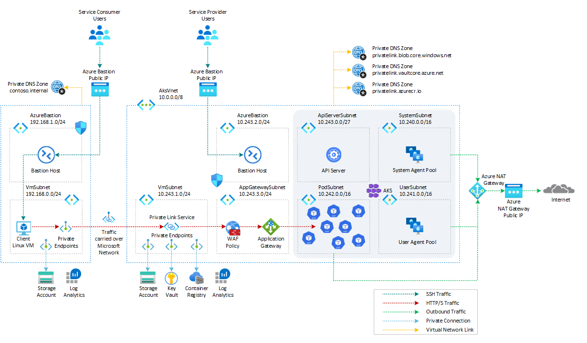

# How to call a workload in AKS via Private Link, Application Gateway, and Application Gateway Ingress Controller

[Azure Application Gateway](https://learn.microsoft.com/en-us/azure/application-gateway/overview) can connect to a backend application via [Azure Private Link Service (PLS)](https://learn.microsoft.com/en-us/azure/private-link/private-link-service-overview). For more information, see [Application Gateway Private Link](https://learn.microsoft.com/en-us/azure/application-gateway/private-link).

Private Link for Application Gateway allows you to connect workloads over a private connection spanning across different virtual networks and Azure subscriptions. When configured, a private endpoint will be placed into a defined virtual network's subnet, providing a private IP address for client applications looking to communicate to a service behind an Application Gateway. For a list of other PaaS services that support Private Link functionality, see [What is Azure Private Link?](https://learn.microsoft.com/en-us/azure/private-link/private-link-overview).

This article shows how to use [Azure Application Gateway](https://learn.microsoft.com/en-us/azure/application-gateway/overview), [Azure Web Application Firewall](https://learn.microsoft.com/en-us/azure/web-application-firewall/afds/afds-overview), and [Azure Private Link Service (PLS)](https://learn.microsoft.com/en-us/azure/private-link/private-link-service-overview) to securely expose and protect a workload running in [Azure Kubernetes Service(AKS)](https://docs.microsoft.com/en-us/azure/aks/intro-kubernetes) via the [Application Gateway Ingress Controller](https://learn.microsoft.com/en-us/azure/application-gateway/ingress-controller-overview).

## Prerequisites

- An active [Azure subscription](https://docs.microsoft.com/en-us/azure/guides/developer/azure-developer-guide#understanding-accounts-subscriptions-and-billing). If you don't have one, create a [free Azure account](https://azure.microsoft.com/free/) before you begin.
- [Visual Studio Code](https://code.visualstudio.com/) installed on one of the [supported platforms](https://code.visualstudio.com/docs/supporting/requirements#_platforms) along with the [Bicep extension](https://marketplace.visualstudio.com/items?itemName=ms-azuretools.vscode-bicep).

## Architecture

This sample provides a set of Bicep modules to deploy and configure an [Azure Application Gateway](https://learn.microsoft.com/en-us/azure/application-gateway/overview) with an [WAF Policy](https://learn.microsoft.com/en-us/azure/web-application-firewall/afds/afds-overview) as regional layer 7 load balancer in front of a public or a private AKS cluster with [API Server VNET Integration](https://learn.microsoft.com/en-us/azure/aks/api-server-vnet-integration), [Azure CNI](https://learn.microsoft.com/en-us/azure/aks/configure-azure-cni) as a network plugin and [Dynamic IP Allocation](https://learn.microsoft.com/en-us/azure/aks/configure-azure-cni#dynamic-allocation-of-ips-and-enhanced-subnet-support). The sample implements a scenario where a client application consumes a service exposed by a SaaS provider. The server application workload runs on an [Azure Kubernetes Service(AKS)](https://docs.microsoft.com/en-us/azure/aks/intro-kubernetes) cluster and is exposed via the [Application Gateway Ingress Controller](https://learn.microsoft.com/en-us/azure/application-gateway/ingress-controller-overview). The frontend IP configuration of the [Azure Application Gateway](https://learn.microsoft.com/en-us/azure/application-gateway/overview) is configured to be exposed via [Private Link](https://learn.microsoft.com/en-us/azure/application-gateway/private-link). A frontend IP address is the IP address associated with an application gateway. You can configure an application gateway to have a public IP address, a private IP address, or both. An application gateway supports one public or one private IP address. Your virtual network and public IP address must be in the same location as your application gateway.

> **NOTE**  
> At the time of this writing, [Application Gateway Private Link](https://learn.microsoft.com/en-us/azure/application-gateway/private-link) configuration support for tunneling traffic through an Azure private endpoint to a private IP only Application Gateway is unsupported.

The following diagram shows the architecture and network topology deployed by the sample:



A [Deployment Script](https://learn.microsoft.com/en-us/azure/azure-resource-manager/bicep/deployment-script-bicep) is used to create a sample [httpbin](https://httpbin.org/) web application via YAML manifests. An [ingress](https://kubernetes.io/docs/concepts/services-networking/ingress/) is created to expose the Kubernetes service via the [Azure Application Gateway](https://learn.microsoft.com/en-us/azure/application-gateway/overview) via the [Application Gateway Ingress Controller](https://learn.microsoft.com/en-us/azure/application-gateway/ingress-controller-overview).

Bicep modules are parametric, so you can choose any network plugin:

- [Azure CNI with static IP allocation](https://learn.microsoft.com/en-us/azure/aks/configure-azure-cni)
- [Azure CNI with dynamic IP allocation](https://learn.microsoft.com/en-us/azure/aks/configure-azure-cni-dynamic-ip-allocation)
- [Azure CNI Powered by Cilium](https://learn.microsoft.com/en-us/azure/aks/azure-cni-powered-by-cilium)
- [Azure CNI Overlay](https://learn.microsoft.com/en-us/azure/aks/azure-cni-overlay)
- [BYO CNI](https://learn.microsoft.com/en-us/azure/aks/use-byo-cni?tabs=azure-cli)
- [Kubenet](https://learn.microsoft.com/en-us/azure/aks/configure-kubenet)

> **NOTE**  
> The sample was tested only with [Azure CNI with dynamic IP allocation](https://learn.microsoft.com/en-us/azure/aks/configure-azure-cni). [Azure CNI Overlay](https://learn.microsoft.com/en-us/azure/aks/azure-cni-overlay) does not currently support the [Application Gateway Ingress Controller](https://learn.microsoft.com/en-us/azure/application-gateway/ingress-controller-overview). For more information, see [Limitations with Azure CNI Overlay](https://learn.microsoft.com/en-us/azure/aks/azure-cni-overlay#limitations-with-azure-cni-overlay).

The Bicep modules also allow installing the following extensions and add-ons for [Azure Kubernetes Service(AKS)](https://docs.microsoft.com/en-us/azure/aks/intro-kubernetes):

In addition, this sample shows how to deploy an [Azure Kubernetes Service](https://docs.microsoft.com/en-us/azure/aks/intro-kubernetes) cluster with the following features:

- [API Server VNET Integration](https://learn.microsoft.com/en-us/azure/aks/api-server-vnet-integration) allows you to enable network communication between the API server and the cluster nodes without requiring a private link or tunnel. AKS clusters with API Server VNET integration provide a series of advantages, for example, they can have public network access or private cluster mode enabled or disabled without redeploying the cluster. For more information, see [Create an Azure Kubernetes Service cluster with API Server VNet Integration](https://learn.microsoft.com/en-us/azure/aks/api-server-vnet-integration).
- [Azure NAT Gateway](https://learn.microsoft.com/en-us/azure/virtual-network/nat-gateway/nat-overview) to manage outbound connections initiated by AKS-hosted workloads.
- [Event-driven Autoscaling (KEDA) add-on](https://learn.microsoft.com/en-us/azure/aks/keda-about) is a single-purpose and lightweight component that strives to make application autoscaling simple and is a CNCF Incubation project.
- [Dapr extension for Azure Kubernetes Service (AKS)](https://learn.microsoft.com/en-us/azure/aks/dapr) allows you to install [Dapr](https://dapr.io/), a portable, event-driven runtime that simplifies building resilient, stateless, and stateful applications that run on the cloud and edge and embrace the diversity of languages and developer frameworks. With its sidecar architecture, Dapr helps you tackle the challenges that come with building microservices and keeps your code platform agnostic.
- [Flux V2 extension](https://learn.microsoft.com/en-us/azure/azure-arc/kubernetes/tutorial-use-gitops-flux2?tabs=azure-cli) allows to deploy workloads to an Azure Kubernetes Service (AKS) cluster via [GitOps](https://www.weave.works/technologies/gitops/). For more information, see [GitOps Flux v2 configurations with AKS and Azure Arc-enabled Kubernetes](https://learn.microsoft.com/en-us/azure/azure-arc/kubernetes/conceptual-gitops-flux2)
- [Vertical Pod Autoscaling](https://learn.microsoft.com/en-us/azure/aks/vertical-pod-autoscaler) allows you to automatically sets resource requests and limits on containers per workload based on past usage. VPA makes certain pods are scheduled onto nodes that have the required CPU and memory resources. For more information, see [Kubernetes Vertical Pod Autoscaling](https://itnext.io/k8s-vertical-pod-autoscaling-fd9e602cbf81).
- [Azure Key Vault Provider for Secrets Store CSI Driver](https://learn.microsoft.com/en-us/azure/aks/csi-secrets-store-identity-access) provides a variety of methods of identity-based access to your [Azure Key Vault](https://learn.microsoft.com/en-us/azure/key-vault/general/overview).
- [Open Service Mesh add-on](https://learn.microsoft.com/en-us/azure/aks/open-service-mesh-about) is a lightweight, extensible, cloud native service mesh that allows you to uniformly manage, secure, and get out-of-the-box observability features for highly dynamic microservice environments.

In a production environment, we strongly recommend deploying a [private AKS cluster](https://docs.microsoft.com/en-us/azure/aks/private-clusters) with [Uptime SLA](https://docs.microsoft.com/en-us/azure/aks/uptime-sla). For more information, see [private AKS cluster with a Public DNS address](https://docs.microsoft.com/en-us/azure/aks/private-clusters#create-a-private-aks-cluster-with-a-public-dns-address). Alternatively, you can deploy a public AKS cluster and secure access to the API server using [authorized IP address ranges](https://learn.microsoft.com/en-us/azure/aks/api-server-authorized-ip-ranges).

The Bicep modules deploy the following Azure resources for the service provider:

- [Microsoft.Network/applicationGateways](https://learn.microsoft.com/en-us/azure/templates/microsoft.network/applicationgateways?pivots=deployment-language-bicep): an [Azure Application Gateway](https://learn.microsoft.com/en-us/azure/application-gateway/overview) resource used to expose the AKS-hosted sample application via [Azure Private Link Service](https://learn.microsoft.com/en-us/azure/private-link/private-link-service-overview) and [Application Gateway Ingress Controller](https://learn.microsoft.com/en-us/azure/application-gateway/ingress-controller-overview).
- [Microsoft.Network/ApplicationGatewayWebApplicationFirewallPolicies](https://learn.microsoft.com/en-us/azure/templates/microsoft.network/applicationgatewaywebapplicationfirewallpolicies?pivots=deployment-language-bicep): [Azure Web Application Firewall (WAF)](https://learn.microsoft.com/en-us/azure/web-application-firewall/ag/ag-overview) on [Azure Application Gateway](https://learn.microsoft.com/en-us/azure/application-gateway/overview) provides centralized protection for your web applications. WAF defends your web services against common exploits and vulnerabilities. It keeps your service highly available for your users and helps you meet compliance requirements. You can configure a WAF policy and associate that policy to one or more Front Door front-ends for protection. The WAF policy deployed by this sample consists of three types of security rules:
  - [Custom rules](https://learn.microsoft.com/en-us/azure/web-application-firewall/ag/ag-overview#custom-rules) are used to block incoming requests based on the content of the payload, querystring, HTTP request method, IP address of the caller, and more. This sample add a couple of customer rules to block calls coming from a given IP range or calls that contain the word `blockme` in the querystring.
  - [OWASP](https://owasp.org/) [Core rule sets](https://learn.microsoft.com/en-us/azure/web-application-firewall/ag/ag-overview#core-rule-sets) provide an easy way to deploy protection against a common set of security threats like SQL injection or cross-site scripting.
  - [Bot protection rule set](https://learn.microsoft.com/en-us/azure/web-application-firewall/ag/ag-overview#bot-protection-rule-set) can be used to take custom actions on requests from known bot categories.
- [Microsoft.ContainerService/managedClusters](https://learn.microsoft.com/en-us/azure/templates/microsoft.containerservice/managedclusters?pivots=deployment-language-bicep): A public or private AKS cluster composed of a:
  - `system` node pool in a dedicated subnet. The default node pool hosts only critical system pods and services. The worker nodes have node taint which prevents application pods from beings scheduled on this node pool.
  - `user` node pool hosting user workloads and artifacts in a dedicated subnet.
- [Microsoft.Network/virtualNetworks](https://docs.microsoft.com/en-us/azure/templates/microsoft.network/virtualnetworks): a new virtual network with seven subnets:
  - `SystemSubnet`: a subnet used for the agent nodes of the `system` node pool.
  - `UserSubnet`: a subnet used for the agent nodes of the `user` node pool.
  - `PodSubnet`: a subnet used to allocate private IP addresses to pods dynamically.
  - `ApiServerSubnet`: API Server VNET Integration projects the API server endpoint directly into this delegated subnet in the virtual network where the AKS cluster is deployed.
  - `AzureBastionSubnet`: a subnet for the Azure Bastion Host.
  - `VmSubnet`: a subnet for a jump-box virtual machine used to connect to the (private) AKS cluster and for the private endpoints.
  - `AppGatewaySubnet`: a subnet hosting the Application Gateway.
- [Microsoft.ManagedIdentity/userAssignedIdentities](https://learn.microsoft.com/en-us/azure/templates/microsoft.managedidentity/2018-11-30/userassignedidentities?pivots=deployment-language-bicep): a user-defined managed identity used by the AKS cluster to create additional resources like load balancers and managed disks in Azure.
- [Microsoft.Compute/virtualMachines](https://docs.microsoft.com/en-us/azure/templates/microsoft.compute/virtualmachines): Bicep modules can optionally create a jump-box virtual machine to manage the private AKS cluster.
- [Microsoft.Network/bastionHosts](https://docs.microsoft.com/en-us/azure/templates/microsoft.network/bastionhosts): a separate Azure Bastion is deployed in the AKS cluster virtual network to provide SSH connectivity to both agent nodes and virtual machines.
- [Microsoft.Network/natGateways](https://learn.microsoft.com/en-us/azure/templates/microsoft.network/natgateways?pivots=deployment-language-bicep): a bring-your-own (BYO) [Azure NAT Gateway](https://learn.microsoft.com/en-us/azure/virtual-network/nat-gateway/nat-overview) to manage outbound connections initiated by AKS-hosted workloads. The NAT Gateway is associated to the `SystemSubnet`, `UserSubnet`, and `PodSubnet` subnets. The [outboundType](https://learn.microsoft.com/en-us/azure/aks/egress-outboundtype#outbound-type-of-managednatgateway-or-userassignednatgateway) property of the cluster is set to `userAssignedNatGateway` to specify that a BYO NAT Gateway is used for outbound connections. NOTE: you can update the `outboundType` after cluster creation and this will deploy or remove resources as required to put the cluster into the new egress configuration. For more information, see [Updating outboundType after cluster creation](https://learn.microsoft.com/en-us/azure/aks/egress-outboundtype#updating-outboundtype-after-cluster-creation-preview).
- [Microsoft.Storage/storageAccounts](https://docs.microsoft.com/en-us/azure/templates/microsoft.storage/storageaccounts): this storage account is used to store the boot diagnostics logs of both the service provider and service consumer virtual machines. Boot Diagnostics is a debugging feature that allows you to view console output and screenshots to diagnose virtual machine status.
- [Microsoft.ContainerRegistry/registries](https://learn.microsoft.com/en-us/azure/templates/microsoft.containerregistry/registries?pivots=deployment-language-bicep): an Azure Container Registry (ACR) to build, store, and manage container images and artifacts in a private registry for all container deployments.
- [Microsoft.KeyVault/vaults](https://learn.microsoft.com/en-us/azure/templates/microsoft.keyvault/vaults?pivots=deployment-language-bicep): an Azure Key Vault used to store secrets, certificates, and keys that can be mounted as files by pods using [Azure Key Vault Provider for Secrets Store CSI Driver](https://github.com/Azure/secrets-store-csi-driver-provider-azure). For more information, see [Use the Azure Key Vault Provider for Secrets Store CSI Driver in an AKS cluster](https://learn.microsoft.com/en-us/azure/aks/csi-secrets-store-driver) and [Provide an identity to access the Azure Key Vault Provider for Secrets Store CSI Driver](https://learn.microsoft.com/en-us/azure/aks/csi-secrets-store-identity-access).
- [Microsoft.Network/privateEndpoints](https://docs.microsoft.com/en-us/azure/templates/microsoft.network/privateendpoints): an [Azure Private Endpoints](https://docs.microsoft.com/en-us/azure/private-link/private-endpoint-overview) is created for each of the following resources:
  - Azure Container Registry
  - Azure Key Vault
  - Azure Storage Account
  - API Server when deploying a private AKS cluster.
- [Microsoft.Network/privateDnsZones](https://docs.microsoft.com/en-us/azure/templates/microsoft.network/privatednszones): an [Azure Private DNS Zone](https://docs.microsoft.com/en-us/azure/dns/private-dns-overview) is created for each of the following resources:
  - Azure Container Registry
  - Azure Key Vault
  - Azure Storage Account
  - API Server when deploying a private AKS cluster.
- [Microsoft.Network/networkSecurityGroups](https://docs.microsoft.com/en-us/azure/templates/microsoft.network/networksecuritygroups?tabs=bicep): subnets hosting virtual machines and Azure Bastion Hosts are protected by [Azure Network Security Groups](https://docs.microsoft.com/en-us/azure/virtual-network/network-security-groups-overview) that are used to filter inbound and outbound traffic.
- [Microsoft.OperationalInsights/workspaces](https://docs.microsoft.com/en-us/azure/templates/microsoft.operationalinsights/workspaces): a centralized [Azure Log Analytics](https://docs.microsoft.com/en-us/azure/azure-monitor/logs/log-analytics-workspace-overview) workspace is used to collect the diagnostics logs and metrics from all the Azure resources:
  - Azure Kubernetes Service cluster
  - Azure Key Vault
  - Azure Network Security Group
  - Azure Container Registry
  - Azure Storage Account
  - Azure jump-box virtual machine
- [Microsoft.Resources/deploymentScripts](https://learn.microsoft.com/en-us/azure/templates/microsoft.resources/deploymentscripts?pivots=deployment-language-bicep): a deployment script is used to run the `install-helm-charts-and-app.sh` Bash script which installs the [httpbin](https://httpbin.org/) web application via YAML templates and the following packages to the AKS cluster via [Helm](https://helm.sh/). For more information on deployment scripts, see [Use deployment scripts in Bicep](https://learn.microsoft.com/en-us/azure/azure-resource-manager/bicep/deployment-script-bicep)
  - [NGINX Ingress Controller](https://docs.nginx.com/nginx-ingress-controller/)
  - [Cert-Manager](https://cert-manager.io/docs/)
  - [Prometheus](https://prometheus.io/)

The Bicep modules deploy the following Azure resources for the service consumer:

- [Microsoft.Network/virtualNetworks](https://docs.microsoft.com/en-us/azure/templates/microsoft.network/virtualnetworks): a new virtual network with two subnets:
  - `AzureBastionSubnet`: a subnet for the Azure Bastion Host.
  - `VmSubnet`: a subnet for the client virtual machine and Private Endpoints.
- [Microsoft.Compute/virtualMachines](https://docs.microsoft.com/en-us/azure/templates/microsoft.compute/virtualmachines): this client virtual machine can be used to call the sample application the AKS-hosted server application via and [Azure Private Endpoint](https://learn.microsoft.com/en-us/azure/private-link/private-endpoint-overview) that refers the [Application Gateway Private Link](https://learn.microsoft.com/en-us/azure/application-gateway/private-link), [Azure Application Gateway](https://learn.microsoft.com/en-us/azure/application-gateway/overview), and [Application Gateway Ingress Controller](https://learn.microsoft.com/en-us/azure/application-gateway/ingress-controller-overview).
- [Microsoft.Network/bastionHosts](https://docs.microsoft.com/en-us/azure/templates/microsoft.network/bastionhosts): this Azure Bastion host can be used to connect to the client virtual machine via SSH.
- [Microsoft.OperationalInsights/workspaces](https://docs.microsoft.com/en-us/azure/templates/microsoft.operationalinsights/workspaces): a centralized [Azure Log Analytics](https://docs.microsoft.com/en-us/azure/azure-monitor/logs/log-analytics-workspace-overview) workspace is used to collect the diagnostics logs and metrics from the client virtual machine

> **NOTE**  
> You can find the `architecture.vsdx` file used for the diagram under the `visio` folder.

## What is Bicep?

[Bicep](https://docs.microsoft.com/en-us/azure/azure-resource-manager/bicep/overview) is a domain-specific language (DSL) that uses a declarative syntax to deploy Azure resources. It provides concise syntax, reliable type safety, and support for code reuse. Bicep offers the best authoring experience for your infrastructure-as-code solutions in Azure.

## Deploy the Bicep modules

You can deploy the Bicep modules in the `bicep` folder using the `deploy.sh` Bash script in the same folder. Specify a value for the following parameters in the `deploy.sh` script and `main.parameters.json` parameters file before deploying the Bicep modules.

- `prefix`: specifies a prefix for all the Azure resources.
- `authenticationType`: specifies the type of authentication when accessing the Virtual Machine. `sshPublicKey` is the recommended value. Allowed values: `sshPublicKey` and `password`.
- `vmAdminUsername`: specifies the name of the administrator account of the virtual machine.
- `vmAdminPasswordOrKey`: specifies the SSH Key or password for the virtual machine.
- `aksClusterSshPublicKey`:  specifies the SSH Key or password for AKS cluster agent nodes.
- `aadProfileAdminGroupObjectIDs`: when deploying an AKS cluster with Azure AD and Azure RBAC integration, this array parameter contains the list of Azure AD group object IDs that will have the admin role of the cluster.
- `keyVaultObjectIds`: Specifies the object ID of the service principals to configure in Key Vault access policies.

We suggest reading sensitive configuration data such as passwords or SSH keys from a pre-existing Azure Key Vault resource. For more information, see [Use Azure Key Vault to pass secure parameter value during Bicep deployment](https://docs.microsoft.com/en-us/azure/azure-resource-manager/bicep/key-vault-parameter?tabs=azure-cli).

```bash
#!/bin/bash

# Template
template="main.bicep"
parameters="main.parameters.json"

# AKS cluster name
prefix="Yellow"
aksName="${prefix}Aks"
validateTemplate=1
useWhatIf=1
update=1
installExtensions=0

# Name and location of the resource group for the Azure Kubernetes Service (AKS) cluster
aksResourceGroupName="${prefix}RG"
location="northeurope"

# Name and resource group name of the Azure Container Registry used by the AKS cluster.
# The name of the cluster is also used to create or select an existing admin group in the Azure AD tenant.
acrName="${prefix}Acr"
acrResourceGroupName="$aksResourceGroupName"
acrSku="Premium"

# Name of Key Vault
keyVaultName="${prefix}KeyVault"

# Name of the Log Analytics
logAnalyticsWorkspaceName="${prefix}LogAnalytics"

# Name of the virtual machine
vmName="${prefix}Vm"

# Subscription id, subscription name, and tenant id of the current subscription
subscriptionId=$(az account show --query id --output tsv)
subscriptionName=$(az account show --query name --output tsv)
tenantId=$(az account show --query tenantId --output tsv)

# Install aks-preview Azure extension
if [[ $installExtensions == 1 ]]; then
  echo "Checking if [aks-preview] extension is already installed..."
  az extension show --name aks-preview &>/dev/null

  if [[ $? == 0 ]]; then
    echo "[aks-preview] extension is already installed"

    # Update the extension to make sure you have the latest version installed
    echo "Updating [aks-preview] extension..."
    az extension update --name aks-preview &>/dev/null
  else
    echo "[aks-preview] extension is not installed. Installing..."

    # Install aks-preview extension
    az extension add --name aks-preview 1>/dev/null

    if [[ $? == 0 ]]; then
      echo "[aks-preview] extension successfully installed"
    else
      echo "Failed to install [aks-preview] extension"
      exit
    fi
  fi

  # Registering AKS features
  aksExtensions=(
    "AKS-KedaPreview"
    "RunCommandPreview"
    "EnableOIDCIssuerPreview"
    "EnableWorkloadIdentityPreview"
    "EnableImageCleanerPreview"
    "AKS-VPAPreview")
  ok=0
  registeringExtensions=()
  for aksExtension in ${aksExtensions[@]}; do
    echo "Checking if [$aksExtension] extension is already registered..."
    extension=$(az feature list -o table --query "[?contains(name, 'Microsoft.ContainerService/$aksExtension') && @.properties.state == 'Registered'].{Name:name}" --output tsv)
    if [[ -z $extension ]]; then
      echo "[$aksExtension] extension is not registered."
      echo "Registering [$aksExtension] extension..."
      az feature register --name $aksExtension --namespace Microsoft.ContainerService
      registeringExtensions+=("$aksExtension")
      ok=1
    else
      echo "[$aksExtension] extension is already registered."
    fi
  done
  echo $registeringExtensions
  delay=1
  for aksExtension in ${registeringExtensions[@]}; do
    echo -n "Checking if [$aksExtension] extension is already registered..."
    while true; do
      extension=$(az feature list -o table --query "[?contains(name, 'Microsoft.ContainerService/$aksExtension') && @.properties.state == 'Registered'].{Name:name}" --output tsv)
      if [[ -z $extension ]]; then
        echo -n "."
        sleep $delay
      else
        echo "."
        break
      fi
    done
  done

  if [[ $ok == 1 ]]; then
    echo "Refreshing the registration of the Microsoft.ContainerService resource provider..."
    az provider register --namespace Microsoft.ContainerService
    echo "Microsoft.ContainerService resource provider registration successfully refreshed"
  fi

  # Registering Network features
  networkExtensions=("EnableApplicationGatewayNetworkIsolation")
  ok=0
  registeringExtensions=()
  for networkExtension in ${networkExtensions[@]}; do
    echo "Checking if [$networkExtension] extension is already registered..."
    extension=$(az feature list -o table --query "[?contains(name, 'Microsoft.Network/$networkExtension') && @.properties.state == 'Registered'].{Name:name}" --output tsv)
    if [[ -z $extension ]]; then
      echo "[$networkExtension] extension is not registered."
      echo "Registering [$networkExtension] extension..."
      az feature register --name $networkExtension --namespace Microsoft.ContainerService
      registeringExtensions+=("$networkExtension")
      ok=1
    else
      echo "[$networkExtension] extension is already registered."
    fi
  done
  echo $registeringExtensions
  delay=1
  for networkExtension in ${registeringExtensions[@]}; do
    echo -n "Checking if [$networkExtension] extension is already registered..."
    while true; do
      extension=$(az feature list -o table --query "[?contains(name, 'Microsoft.Network/$networkExtension') && @.properties.state == 'Registered'].{Name:name}" --output tsv)
      if [[ -z $extension ]]; then
        echo -n "."
        sleep $delay
      else
        echo "."
        break
      fi
    done
  done

  if [[ $ok == 1 ]]; then
    echo "Refreshing the registration of the Microsoft.ContainerService resource provider..."
    az provider register --namespace Microsoft.Network
    echo "Microsoft.ContainerService resource provider registration successfully refreshed"
  fi
fi

# Get the last Kubernetes version available in the region
kubernetesVersion=$(az aks get-versions --location $location --query "orchestrators[?isPreview==false].orchestratorVersion | sort(@) | [-1]" --output tsv)

if [[ -n $kubernetesVersion ]]; then
  echo "Successfully retrieved the last Kubernetes version [$kubernetesVersion] supported by AKS in [$location] Azure region"
else
  echo "Failed to retrieve the last Kubernetes version supported by AKS in [$location] Azure region"
  exit
fi

# Check if the resource group already exists
echo "Checking if [$aksResourceGroupName] resource group actually exists in the [$subscriptionName] subscription..."

az group show --name $aksResourceGroupName &>/dev/null

if [[ $? != 0 ]]; then
  echo "No [$aksResourceGroupName] resource group actually exists in the [$subscriptionName] subscription"
  echo "Creating [$aksResourceGroupName] resource group in the [$subscriptionName] subscription..."

  # Create the resource group
  az group create --name $aksResourceGroupName --location $location 1>/dev/null

  if [[ $? == 0 ]]; then
    echo "[$aksResourceGroupName] resource group successfully created in the [$subscriptionName] subscription"
  else
    echo "Failed to create [$aksResourceGroupName] resource group in the [$subscriptionName] subscription"
    exit
  fi
else
  echo "[$aksResourceGroupName] resource group already exists in the [$subscriptionName] subscription"
fi

# Create AKS cluster if does not exist
echo "Checking if [$aksName] aks cluster actually exists in the [$aksResourceGroupName] resource group..."

az aks show --name $aksName --resource-group $aksResourceGroupName &>/dev/null
notExists=$?

if [[ $notExists != 0 || $update == 1 ]]; then

  if [[ $notExists != 0 ]]; then
    echo "No [$aksName] aks cluster actually exists in the [$aksResourceGroupName] resource group"
  else
    echo "[$aksName] aks cluster already exists in the [$aksResourceGroupName] resource group. Updating the cluster..."
  fi

  # Delete any existing role assignments for the user-defined managed identity of the AKS cluster
  # in case you are re-deploying the solution in an existing resource group
  echo "Retrieving the list of role assignments on [$aksResourceGroupName] resource group..."
  assignmentIds=$(az role assignment list \
    --scope "/subscriptions/${subscriptionId}/resourceGroups/${aksResourceGroupName}" \
    --query [].id \
    --output tsv \
    --only-show-errors)

  if [[ -n $assignmentIds ]]; then
    echo "[${#assignmentIds[@]}] role assignments have been found on [$aksResourceGroupName] resource group"
    for assignmentId in ${assignmentIds[@]}; do
      if [[ -n $assignmentId ]]; then
        az role assignment delete --ids $assignmentId

        if [[ $? == 0 ]]; then
          assignmentName=$(echo $assignmentId | awk -F '/' '{print $NF}')
          echo "[$assignmentName] role assignment on [$aksResourceGroupName] resource group successfully deleted"
        fi
      fi
    done
  else
    echo "No role assignment actually exists on [$aksResourceGroupName] resource group"
  fi

  # Get the kubelet managed identity used by the AKS cluster
  echo "Retrieving the kubelet identity from the [$aksName] AKS cluster..."
  clientId=$(az aks show \
    --name $aksName \
    --resource-group $aksResourceGroupName \
    --query identityProfile.kubeletidentity.clientId \
    --output tsv 2>/dev/null)

  if [[ -n $clientId ]]; then
    # Delete any role assignment to kubelet managed identity on any ACR in the resource group
    echo "kubelet identity of the [$aksName] AKS cluster successfully retrieved"
    echo "Retrieving the list of ACR resources in the [$aksResourceGroupName] resource group..."
    acrIds=$(az acr list \
      --resource-group $aksResourceGroupName \
      --query [].id \
      --output tsv)

    if [[ -n $acrIds ]]; then
      echo "[${#acrIds[@]}] ACR resources have been found in [$aksResourceGroupName] resource group"
      for acrId in ${acrIds[@]}; do
        if [[ -n $acrId ]]; then
          acrName=$(echo $acrId | awk -F '/' '{print $NF}')
          echo "Retrieving the list of role assignments on [$acrName] ACR..."
          assignmentIds=$(az role assignment list \
            --scope "$acrId" \
            --query [].id \
            --output tsv \
            --only-show-errors)

          if [[ -n $assignmentIds ]]; then
            echo "[${#assignmentIds[@]}] role assignments have been found on [$acrName] ACR"
            for assignmentId in ${assignmentIds[@]}; do
              if [[ -n $assignmentId ]]; then
                az role assignment delete --ids $assignmentId

                if [[ $? == 0 ]]; then
                  assignmentName=$(echo $assignmentId | awk -F '/' '{print $NF}')
                  echo "[$assignmentName] role assignment on [$acrName] ACR successfully deleted"
                fi
              fi
            done
          else
            echo "No role assignment actually exists on [$acrName] ACR"
          fi
        fi
      done
    else
      echo "No ACR actually exists in [$aksResourceGroupName] resource group"
    fi
  else
    echo "No kubelet identity exists for the [$aksName] AKS cluster"
  fi

  # Validate the Bicep template
  if [[ $validateTemplate == 1 ]]; then
    if [[ $useWhatIf == 1 ]]; then
      # Execute a deployment What-If operation at resource group scope.
      echo "Previewing changes deployed by [$template] Bicep template..."
      az deployment group what-if \
        --resource-group $aksResourceGroupName \
        --template-file $template \
        --parameters $parameters \
        --parameters \
        prefix=$prefix \
        aksClusterName=$aksName \
        aksClusterKubernetesVersion=$kubernetesVersion \
        acrName=$acrName \
        keyVaultName=$keyVaultName \
        logAnalyticsWorkspaceName=$logAnalyticsWorkspaceName \
        vmName=$vmName

      if [[ $? == 0 ]]; then
        echo "[$template] Bicep template validation succeeded"
      else
        echo "Failed to validate [$template] Bicep template"
        exit
      fi
    else
      # Validate the Bicep template
      echo "Validating [$template] Bicep template..."
      output=$(az deployment group validate \
        --resource-group $aksResourceGroupName \
        --template-file $template \
        --parameters $parameters \
        --parameters \
        prefix=$prefix \
        aksClusterName=$aksName \
        aksClusterKubernetesVersion=$kubernetesVersion \
        acrName=$acrName \
        keyVaultName=$keyVaultName \
        logAnalyticsWorkspaceName=$logAnalyticsWorkspaceName \
        vmName=$vmName)

      if [[ $? == 0 ]]; then
        echo "[$template] Bicep template validation succeeded"
      else
        echo "Failed to validate [$template] Bicep template"
        echo $output
        exit
      fi
    fi
  fi

  # Deploy the Bicep template
  echo "Deploying [$template] Bicep template..."
  az deployment group create \
    --resource-group $aksResourceGroupName \
    --only-show-errors \
    --template-file $template \
    --parameters $parameters \
    --parameters \
    prefix=$prefix \
    aksClusterName=$aksName \
    aksClusterKubernetesVersion=$kubernetesVersion \
    acrName=$acrName \
    keyVaultName=$keyVaultName \
    logAnalyticsWorkspaceName=$logAnalyticsWorkspaceName \
    vmName=$vmName 1>/dev/null

  if [[ $? == 0 ]]; then
    echo "[$template] Bicep template successfully provisioned"
  else
    echo "Failed to provision the [$template] Bicep template"
    exit
  fi
else
  echo "[$aksName] aks cluster already exists in the [$aksResourceGroupName] resource group"
fi

# Create AKS cluster if does not exist
echo "Checking if [$aksName] aks cluster actually exists in the [$aksResourceGroupName] resource group..."

az aks show --name $aksName --resource-group $aksResourceGroupName &>/dev/null

if [[ $? != 0 ]]; then
  echo "No [$aksName] aks cluster actually exists in the [$aksResourceGroupName] resource group"
  exit
fi

# Get the user principal name of the current user
echo "Retrieving the user principal name of the current user from the [$tenantId] Azure AD tenant..."
userPrincipalName=$(az account show --query user.name --output tsv)
if [[ -n $userPrincipalName ]]; then
  echo "[$userPrincipalName] user principal name successfully retrieved from the [$tenantId] Azure AD tenant"
else
  echo "Failed to retrieve the user principal name of the current user from the [$tenantId] Azure AD tenant"
  exit
fi

# Retrieve the objectId of the user in the Azure AD tenant used by AKS for user authentication
echo "Retrieving the objectId of the [$userPrincipalName] user principal name from the [$tenantId] Azure AD tenant..."
userObjectId=$(az ad user show --id $userPrincipalName --query id --output tsv 2>/dev/null)

if [[ -n $userObjectId ]]; then
  echo "[$userObjectId] objectId successfully retrieved for the [$userPrincipalName] user principal name"
else
  echo "Failed to retrieve the objectId of the [$userPrincipalName] user principal name"
  exit
fi

# Retrieve the resource id of the AKS cluster
echo "Retrieving the resource id of the [$aksName] AKS cluster..."
aksClusterId=$(az aks show \
  --name "$aksName" \
  --resource-group "$aksResourceGroupName" \
  --query id \
  --output tsv 2>/dev/null)

if [[ -n $aksClusterId ]]; then
  echo "Resource id of the [$aksName] AKS cluster successfully retrieved"
else
  echo "Failed to retrieve the resource id of the [$aksName] AKS cluster"
  exit
fi

# Assign Azure Kubernetes Service RBAC Cluster Admin role to the current user
role="Azure Kubernetes Service RBAC Cluster Admin"
echo "Checking if [$userPrincipalName] user has been assigned to [$role] role on the [$aksName] AKS cluster..."
current=$(az role assignment list \
  --assignee $userObjectId \
  --scope $aksClusterId \
  --query "[?roleDefinitionName=='$role'].roleDefinitionName" \
  --output tsv 2>/dev/null)

if [[ $current == "Owner" ]] || [[ $current == "Contributor" ]] || [[ $current == "$role" ]]; then
  echo "[$userPrincipalName] user is already assigned to the [$current] role on the [$aksName] AKS cluster"
else
  echo "[$userPrincipalName] user is not assigned to the [$role] role on the [$aksName] AKS cluster"
  echo "Assigning the [$userPrincipalName] user to the [$role] role on the [$aksName] AKS cluster..."

  az role assignment create \
    --role "$role" \
    --assignee $userObjectId \
    --scope $aksClusterId \
    --only-show-errors 1>/dev/null

  if [[ $? == 0 ]]; then
    echo "[$userPrincipalName] user successfully assigned to the [$role] role on the [$aksName] AKS cluster"
  else
    echo "Failed to assign the [$userPrincipalName] user to the [$role] role on the [$aksName] AKS cluster"
    exit
  fi
fi

# Assign Azure Kubernetes Service Cluster Admin Role role to the current user
role="Azure Kubernetes Service Cluster Admin Role"
echo "Checking if [$userPrincipalName] user has been assigned to [$role] role on the [$aksName] AKS cluster..."
current=$(az role assignment list \
  --assignee $userObjectId \
  --scope $aksClusterId \
  --query "[?roleDefinitionName=='$role'].roleDefinitionName" \
  --output tsv 2>/dev/null)

if [[ $current == "Owner" ]] || [[ $current == "Contributor" ]] || [[ $current == "$role" ]]; then
  echo "[$userPrincipalName] user is already assigned to the [$current] role on the [$aksName] AKS cluster"
else
  echo "[$userPrincipalName] user is not assigned to the [$role] role on the [$aksName] AKS cluster"
  echo "Assigning the [$userPrincipalName] user to the [$role] role on the [$aksName] AKS cluster..."

  az role assignment create \
    --role "$role" \
    --assignee $userObjectId \
    --scope $aksClusterId \
    --only-show-errors 1>/dev/null

  if [[ $? == 0 ]]; then
    echo "[$userPrincipalName] user successfully assigned to the [$role] role on the [$aksName] AKS cluster"
  else
    echo "Failed to assign the [$userPrincipalName] user to the [$role] role on the [$aksName] AKS cluster"
    exit
  fi
fi
```

## Deployment Script

The sample makes use of a [Deployment Script](https://learn.microsoft.com/en-us/azure/azure-resource-manager/bicep/deployment-script-bicep) to run the `install-helm-charts-and-agic-sample.sh` Bash script which installs the [httpbin](https://httpbin.org/) web application via YAML templates and the following packages to the AKS cluster via [Helm](https://helm.sh/). For more information on deployment scripts, see [Use deployment scripts in Bicep](https://learn.microsoft.com/en-us/azure/azure-resource-manager/bicep/deployment-script-bicep). The script also installs the [cert-Manager](https://cert-manager.io/docs/) via Helm and a [cluster issues](https://cert-manager.io/docs/configuration/) for the [Application Gateway Ingress Controller](https://learn.microsoft.com/en-us/azure/application-gateway/ingress-controller-overview).

```bash
# Install kubectl
az aks install-cli --only-show-errors

# Get AKS credentials
az aks get-credentials \
  --admin \
  --name $clusterName \
  --resource-group $resourceGroupName \
  --subscription $subscriptionId \
  --only-show-errors

# Check if the cluster is private or not
private=$(az aks show --name $clusterName \
  --resource-group $resourceGroupName \
  --subscription $subscriptionId \
  --query apiServerAccessProfile.enablePrivateCluster \
  --output tsv)

# Install Helm
curl https://raw.githubusercontent.com/helm/helm/main/scripts/get-helm-3 -o get_helm.sh -s
chmod 700 get_helm.sh
./get_helm.sh &>/dev/null

# Add Helm repos
helm repo add jetstack https://charts.jetstack.io

# Update Helm repos
helm repo update

if [[ $private == 'true' ]]; then
  # Log whether the cluster is public or private
  echo "$clusterName AKS cluster is public"

  # Install certificate manager
  command="helm install cert-manager jetstack/cert-manager \
    --create-namespace \
    --namespace cert-manager \
    --set installCRDs=true \
    --set nodeSelector.\"kubernetes\.io/os\"=linux"

  az aks command invoke \
    --name $clusterName \
    --resource-group $resourceGroupName \
    --subscription $subscriptionId \
    --command "$command"
  
    # Create cluster issuer for the Application Gateway Ingress Controller (AGIC)
  command="cat <<EOF | kubectl apply -f -
apiVersion: cert-manager.io/v1
kind: ClusterIssuer
metadata:
  name: letsencrypt-application-gateway
spec:
  acme:
    server: https://acme-v02.api.letsencrypt.org/directory
    email: $email
    privateKeySecretRef:
      name: letsencrypt
    solvers:
    - http01:
        ingress:
          class: azure/application-gateway
          podTemplate:
            spec:
              nodeSelector:
                "kubernetes.io/os": linux
EOF"

  az aks command invoke \
    --name $clusterName \
    --resource-group $resourceGroupName \
    --subscription $subscriptionId \
    --command "$command"

  # Create a namespace for the application
  command="kubectl create namespace $namespace"

  az aks command invoke \
    --name $clusterName \
    --resource-group $resourceGroupName \
    --subscription $subscriptionId \
    --command "$command"

  # Create a deployment and service for the application
  command="cat <<EOF | kubectl apply -n $namespace -f -
apiVersion: apps/v1
kind: Deployment
metadata:
  name: httpbin
spec:
  replicas: 3
  selector:
    matchLabels:
      app: httpbin
  template:
    metadata:
      labels:
        app: httpbin
    spec:
      topologySpreadConstraints:
      - maxSkew: 1
        topologyKey: topology.kubernetes.io/zone
        whenUnsatisfiable: DoNotSchedule
        labelSelector:
          matchLabels:
            app: httpbin
      - maxSkew: 1
        topologyKey: kubernetes.io/hostname
        whenUnsatisfiable: DoNotSchedule
        labelSelector:
          matchLabels:
            app: httpbin
      nodeSelector:
        "kubernetes.io/os": linux
      containers:
      - image: docker.io/kennethreitz/httpbin
        imagePullPolicy: IfNotPresent
        name: httpbin
        resources:
          requests:
            memory: "64Mi"
            cpu: "125m"
          limits:
            memory: "128Mi"
            cpu: "250m"
        ports:
        - containerPort: 80
        env:
        - name: PORT
          value: "80"
---
apiVersion: v1
kind: Service
metadata:
  name: httpbin
spec:
  ports:
    - port: 80
      targetPort: 80
      protocol: TCP
  type: ClusterIP
  selector:
    app: httpbin
EOF"

  az aks command invoke \
    --name $clusterName \
    --resource-group $resourceGroupName \
    --subscription $subscriptionId \
    --command "$command"

  # Create an ingress resource for the application
  command="cat <<EOF | kubectl apply -n $namespace -f -
apiVersion: networking.k8s.io/v1
kind: Ingress
metadata:
  name: httpbin
spec:
  ingressClassName: azure/application-gateway
  rules:
  - host: $hostName
    http:
      paths:
      - path: /
        pathType: Prefix
        backend:
          service:
            name: httpbin
            port:
              number: 80
EOF"

  az aks command invoke \
    --name $clusterName \
    --resource-group $resourceGroupName \
    --subscription $subscriptionId \
    --command "$command"

else
  # Log whether the cluster is public or private
  echo "$clusterName AKS cluster is public"

  # Install certificate manager
  helm install cert-manager jetstack/cert-manager \
    --create-namespace \
    --namespace cert-manager \
    --set installCRDs=true \
    --set nodeSelector."kubernetes\.io/os"=linux

  # Create cluster issuer for the Application Gateway Ingress Controller (AGIC)
  cat <<EOF | kubectl apply -f -
apiVersion: cert-manager.io/v1
kind: ClusterIssuer
metadata:
  name: letsencrypt-application-gateway
spec:
  acme:
    server: https://acme-v02.api.letsencrypt.org/directory
    email: $email
    privateKeySecretRef:
      name: letsencrypt
    solvers:
    - http01:
        ingress:
          class: azure/application-gateway
          podTemplate:
            spec:
              nodeSelector:
                "kubernetes.io/os": linux
EOF

  # Create a namespace for the application
  kubectl create namespace $namespace

  # Create a deployment and service for the application
  cat <<EOF | kubectl apply -n $namespace -f -
apiVersion: apps/v1
kind: Deployment
metadata:
  name: httpbin
spec:
  replicas: 3
  selector:
    matchLabels:
      app: httpbin
  template:
    metadata:
      labels:
        app: httpbin
    spec:
      topologySpreadConstraints:
      - maxSkew: 1
        topologyKey: topology.kubernetes.io/zone
        whenUnsatisfiable: DoNotSchedule
        labelSelector:
          matchLabels:
            app: httpbin
      - maxSkew: 1
        topologyKey: kubernetes.io/hostname
        whenUnsatisfiable: DoNotSchedule
        labelSelector:
          matchLabels:
            app: httpbin
      nodeSelector:
        "kubernetes.io/os": linux
      containers:
      - image: docker.io/kennethreitz/httpbin
        imagePullPolicy: IfNotPresent
        name: httpbin
        resources:
          requests:
            memory: "64Mi"
            cpu: "125m"
          limits:
            memory: "128Mi"
            cpu: "250m"
        ports:
        - containerPort: 80
        env:
        - name: PORT
          value: "80"
---
apiVersion: v1
kind: Service
metadata:
  name: httpbin
spec:
  ports:
    - port: 80
      targetPort: 80
      protocol: TCP
  type: ClusterIP
  selector:
    app: httpbin
EOF

  # Create an ingress resource for the application
  cat <<EOF | kubectl apply -n $namespace -f -
apiVersion: networking.k8s.io/v1
kind: Ingress
metadata:
  name: httpbin
spec:
  ingressClassName: azure-application-gateway
  rules:
  - host: $hostName
    http:
      paths:
      - path: /
        pathType: Prefix
        backend:
          service:
            name: httpbin
            port:
              number: 80
EOF

fi

# Create output as JSON file
echo '{}' |
  jq --arg x 'prometheus' '.prometheus=$x' |
  jq --arg x 'cert-manager' '.certManager=$x' |
  jq --arg x 'ingress-basic' '.nginxIngressController=$x' >$AZ_SCRIPTS_OUTPUT_PATH
```

As you can note, when deploying the [Application Gateway Ingress Controller](https://learn.microsoft.com/en-us/azure/application-gateway/ingress-controller-overview) via Helm, the [service.beta.kubernetes.io/azure-load-balancer-internal](https://learn.microsoft.com/en-us/azure/aks/internal-lb#create-an-internal-load-balancer) to create the `kubernetes-internal` internal load balancer in the node resource group of the AKS cluster and expose the ingress controller service via a private IP address.

In this sample, the [httpbin](https://httpbin.org/) web application via YAML templates. In particular, an [ingress](https://kubernetes.io/docs/concepts/services-networking/ingress/) is used to expose the application via the [Application Gateway Ingress Controller](https://learn.microsoft.com/en-us/azure/application-gateway/ingress-controller-overview) via the HTTP protocol and using the `httpbin.local` hostname. The ingress object can be easily modified to expose the server via HTTPS and provide a certificate for TLS termination. You can use the [cert-manager](https://cert-manager.io/docs/) to issue a [Let's Encrypt](https://letsencrypt.org/) certificate. For more information, see [Securing NGINX-ingress](https://cert-manager.io/docs/tutorials/acme/nginx-ingress/#issuers). In particular, [cert-manager](https://cert-manager.io/docs/) can create and then delete DNS-01 records in [Azure DNS](https://learn.microsoft.com/en-us/azure/dns/dns-overview) but it needs to authenticate to Azure first. The suggested authentication method is [Managed Identity Using AAD Workload Identity](https://cert-manager.io/docs/configuration/acme/dns01/azuredns/#managed-identity-using-aad-pod-identity).

## Alternative Solution

[Azure Private Link Service (PLS)](https://learn.microsoft.com/en-us/azure/private-link/private-link-service-overview) is an infrastructure component that allows users to privately connect via an [Azure Private Endpoint (PE)](https://learn.microsoft.com/en-us/azure/private-link/private-endpoint-overview) in a virtual network in Azure and a Frontend IP Configuration associated with an internal or public [Azure Load Balancer (ALB)](https://learn.microsoft.com/en-us/azure/load-balancer/load-balancer-overview). With Private Link, users as service providers can securely provide their services to consumers who can connect from within Azure or on-premises without data exfiltration risks.

Before Private Link Service integration, users who wanted private connectivity from on-premises or other virtual networks to their services in an [Azure Kubernetes Service(AKS)](https://docs.microsoft.com/en-us/azure/aks/intro-kubernetes) cluster were required to create a Private Link Service (PLS) to reference the cluster Azure Load Balancer, like in this sample. The user would then create an [Azure Private Endpoint (PE)](https://learn.microsoft.com/en-us/azure/private-link/private-endpoint-overview) to connect to the PLS to enable private connectivity. With the [Azure Private Link Service Integration](https://cloud-provider-azure.sigs.k8s.io/topics/pls-integration/) feature, a managed [Azure Private Link Service (PLS)](https://learn.microsoft.com/en-us/azure/private-link/private-link-service-overview) to the AKS cluster load balancer can be created automatically, and the user would only be required to create Private Endpoint connections to it for private connectivity. You can expose a Kubernetes service via a Private Link Service using annotations. For more information, see [Azure Private Link Service Integration](https://cloud-provider-azure.sigs.k8s.io/topics/pls-integration/).

## CI/CD and GitOps Considerations

[Azure Private Link Service Integration](https://cloud-provider-azure.sigs.k8s.io/topics/pls-integration/) simplifies the creation of a [Azure Private Link Service (PLS)](https://learn.microsoft.com/en-us/azure/private-link/private-link-service-overview) when deploying Kubernetes services or ingress controllers via a classic CI/CD pipeline using [Azure DevOps](https://learn.microsoft.com/en-us/azure/aks/devops-pipeline?pivots=pipelines-yaml), [GitHub Actions](https://azure.github.io/kube-labs/1-github-actions.html), [Jenkins](https://learn.microsoft.com/en-us/azure/architecture/solution-ideas/articles/container-cicd-using-jenkins-and-kubernetes-on-azure-container-service), or [GitLab](https://docs.gitlab.com/charts/installation/cloud/aks.html), but even when using a GitOps approach with [Argo CD](https://techcommunity.microsoft.com/t5/apps-on-azure-blog/getting-started-with-gitops-argo-and-azure-kubernetes-service/ba-p/3288595) or [Flux v2](https://learn.microsoft.com/en-us/azure/azure-arc/kubernetes/tutorial-use-gitops-flux2?tabs=azure-cli).

For every workload that you expose via [Azure Private Link Service (PLS)](https://learn.microsoft.com/en-us/azure/private-link/private-link-service-overview) and [Azure Application Gateway](https://learn.microsoft.com/en-us/azure/application-gateway/overview), you need to create - [Microsoft.Cdn/profiles/originGroups](https://learn.microsoft.com/en-us/azure/templates/microsoft.cdn/profiles/origingroups?pivots=deployment-language-bicep): an [Origin Group](https://learn.microsoft.com/en-us/azure/frontdoor/origin?pivots=front-door-standard-premium#origin-group), an [Origin](https://learn.microsoft.com/en-us/azure/frontdoor/origin?pivots=front-door-standard-premium#origin), endpoint, a route, and a security policy if you want to protect the workload with a WAF policy. You can accomplish this task using [az network front-door]([az network front-door](https://learn.microsoft.com/en-us/cli/azure/network/front-door?view=azure-cli-latest)) Azure CLI commands in the CD pipeline used to deploy your service.

## Test the application

If the deployment succeeds, and the private endpoint connection from the [Azure Application Gateway](https://learn.microsoft.com/en-us/azure/application-gateway/overview) instance to the [Azure Private Link Service (PLS)](https://learn.microsoft.com/en-us/azure/private-link/private-link-service-overview) is approved, you should be able to access the AKS-hosted [httpbin](https://httpbin.org/) web application as follows:

- Navigate to the overview page of your Front Door Premium in the Azure Portal and copy the URL from the Endpoint hostname, as shown in the following picture


- Paste and open the URL in your favorite internet browser. You should see the user interface of the [httpbin](https://httpbin.org/) application:


You can use the `bicep/calls.sh` Bash script to simulate a few attacks and see the managed rule set and custom rule of the [Azure Web Application Firewall](https://learn.microsoft.com/en-us/azure/web-application-firewall/afds/afds-overview) in action.

```bash
#!/bin/bash

# Variables
url="<Front Door Endpoint Hostname URL>"

# Call REST API
echo "Calling REST API..."
curl -I -s "$url"

# Simulate SQL injection
echo "Simulating SQL injection..."
curl -I -s "${url}?users=ExampleSQLInjection%27%20--"

# Simulate XSS
echo "Simulating XSS..."
curl -I -s "${url}?users=ExampleXSS%3Cscript%3Ealert%28%27XSS%27%29%3C%2Fscript%3E"

# A custom rule blocks any request with the word blockme in the querystring.
echo "Simulating query string manipulation with the 'attack' word in the query string..."
curl -I -s "${url}?task=blockme"
```

The Bash script should produce the following output, where the first call succeeds, while the remaining one are blocked by the WAF Policy configured in prevention mode.

```Bash
Calling REST API...
HTTP/2 200
content-length: 9593
content-type: text/html; charset=utf-8
accept-ranges: bytes
vary: Accept-Encoding
access-control-allow-origin: *
access-control-allow-credentials: true
x-azure-ref: 05mwQZAAAAADma91JbmU0TJqRqS2lyFurTUlMMzBFREdFMDYwOQA3YTk2NzZiMS0xZmRjLTQ0OWYtYmI1My1hNDUxMDVjNGZmYmM=
x-cache: CONFIG_NOCACHE
date: Tue, 14 Mar 2023 12:47:33 GMT

Simulating SQL injection...
HTTP/2 403
x-azure-ref: 05mwQZAAAAABaQCSGQToQT4tifYGpmsTmTUlMMzBFREdFMDYxNQA3YTk2NzZiMS0xZmRjLTQ0OWYtYmI1My1hNDUxMDVjNGZmYmM=
date: Tue, 14 Mar 2023 12:47:34 GMT

Simulating XSS...
HTTP/2 403
x-azure-ref: 05mwQZAAAAAAJZzCrTmN4TLY+bZOxskzOTUlMMzBFREdFMDYxMwA3YTk2NzZiMS0xZmRjLTQ0OWYtYmI1My1hNDUxMDVjNGZmYmM=
date: Tue, 14 Mar 2023 12:47:33 GMT

Simulating query string manipulation with the 'attack' word in the query string...
HTTP/2 403
x-azure-ref: 05mwQZAAAAADAle0hOg4FTYH6Q1LHIP50TUlMMzBFREdFMDYyMAA3YTk2NzZiMS0xZmRjLTQ0OWYtYmI1My1hNDUxMDVjNGZmYmM=
date: Tue, 14 Mar 2023 12:47:33 GMT
```

[Front Door WAF Policies](https://learn.microsoft.com/en-us/azure/web-application-firewall/afds/afds-overview) and [Application Gateway WAF policies](https://learn.microsoft.com/en-us/azure/web-application-firewall/ag/ag-overview) can be configured to run in the following two modes:

- `Detection mode`: When run in detection mode, WAF doesn't take any other actions other than monitors and logs the request and its matched WAF rule to WAF logs. You can turn on logging diagnostics for Front Door. When you use the portal, go to the Diagnostics section.

- `Prevention mode`: In prevention mode, WAF takes the specified action if a request matches a rule. If a match is found, no further rules with lower priority are evaluated. Any matched requests are also logged in the WAF logs.

For more information, see [Azure Web Application Firewall on Azure Front Door](https://learn.microsoft.com/en-us/azure/web-application-firewall/afds/afds-overview).

## Review deployed resources

Use the Azure portal, Azure CLI, or Azure PowerShell to list the deployed resources in the resource group.

### Azure CLI

```azurecli
az resource list --resource-group <resource-group-name>
```

### PowerShell

```azurepowershell
Get-AzResource -ResourceGroupName <resource-group-name>
```

## Clean up resources

When you no longer need the resources you created, just delete the resource group. This will remove all the Azure resources.

### Azure CLI

```azurecli
az group delete --name <resource-group-name>
```

### PowerShell


```azurepowershell
Remove-AzResourceGroup -Name <resource-group-name>
```

## Next Steps

You could [add a custom domain to your Front Door](https://learn.microsoft.com/en-us/azure/frontdoor/front-door-custom-domain). If you use [Azure DNS](https://learn.microsoft.com/en-us/azure/dns/dns-overview) to manage your domain, you could extend the Bicep modules to automatically create a custom domain for your Front Door and create a CNAME DNS record in your public DNS zone.
